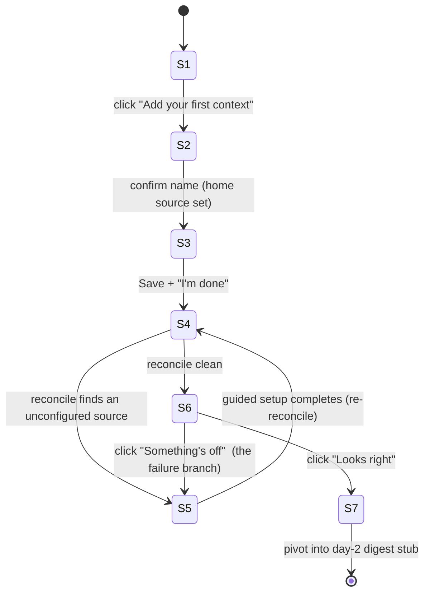

# Mockup Brief — Loopsmith Bootstrap & Loop Studio (#1)

**Hand this to an LLM to build a high-fidelity, clickable mockup** of the Loopsmith
onboarding flow and the Loop Studio canvas.

**What "mockup" means here.** A realistic-looking, clickable front-end with **canned data and
faked interactions** — no real backend, no real reconcile, no real git or GitHub. Clicking moves
between pre-defined screen states; Smith's messages are scripted; the canvas renders fixed
example graphs. It must *look and feel* like the real product, enough to demo and react to. It does
**not** need to actually do anything.

**Build it as** a single-page web app — e.g. React + Tailwind (shadcn/ui for controls), a node-graph
library for the canvas (e.g. React Flow), framer-motion for transitions. Stack is the implementer's
choice; these are defaults, swap freely. The deliverable is the running mockup.

**Two things to mock, in one shell:**
1. **Onboarding** — the day-1 flow from empty console to a verified, running loop (screens S1–S7).
2. **Loop Studio** — the visual loop designer that appears inside onboarding and stands alone (§5).

**Out of scope (don't mock):** the terminal install step (assume the browser is already open at S1),
the day-2 digest beyond a single stub screen, desktop packaging, real persistence.

---

## 1. The feeling to land (so the mockup has a point)

A first-time user, clicking through, should *feel* three beats in order:

1. **"I live in a world of contexts."**
2. **"I describe what I want; Smith makes it real and proves it's running."** (design → reconcile → verify)
3. **"Smith is mine now."** — the assistant that onboarded me is the same one that runs my day (the pivot, S7).

If a screen doesn't sell one of these, cut it. Everything below serves these beats.

---

## 2. The cast on screen

| Element | What it looks like in the mockup |
|---|---|
| **The user** | not drawn; drives via the chat box and the canvas |
| **Smith** | the persistent left-rail chat — the *only* thing on screen before any context exists |
| **Loop Studio** | the center/right canvas — the visual loop designer (§5) |
| **Context / home source / loop / sources** | objects that appear in the workspace as they're created |

The one thing the mockup must prove visually: **you can chat with Smith on the very first screen,
before any context, repo, or loop exists.** Don't gate the chat box behind setup.

---

## 3. Visual system (build this first, reuse everywhere)

**One persistent shell** for the whole mockup. Two panes + a top bar.

```
┌─────────────────────────────────────────────────────────────────────────┐
│  Loopsmith            [ onboarding ●─────○ steady-state ]        ⚙  ?     │  ← top bar
├──────────────────────────┬──────────────────────────────────────────────┤
│   LOOPIE                  │   WORKSPACE                                    │
│   (chat, always present)  │   (swaps content per screen)                   │
│                          │                                                │
│   …scripted messages…    │   empty · context list · Loop Studio ·         │
│                          │   reconcile · guided setup · health · digest   │
│   [ type to Smith … ]    │                                                │
└──────────────────────────┴──────────────────────────────────────────────┘
```

- **Smith rail (left)** — fixed width (~360px), always visible, always the driver. Chat bubbles,
  optional **action cards** (a bubble with a button), a text input pinned to the bottom. Chat stays
  on the **left** — no pane-swap setting in the mockup.
- **Workspace (right)** — fills the rest; its content is swapped per screen state (§4).
- **Top-bar phase pulse** — a single `●───○` indicator that slides between **onboarding** and
  **steady-state**. This is the *only* progress affordance. **No wizard breadcrumb, no "Step 3 of
  7."** It can nudge backward too (a failed check returns to an earlier screen).

**Visual language to apply consistently** (define these tokens once):
- Actor badges: **🧑 human**, **🤖 agent**.
- **⚠ amber** = unconfigured / needs setup (clickable).
- **✓ green** = ready / healthy; **✗ red** = failed.
- Diff colors on the canvas: **green = added**, **red = removed**.
- **◇ diamond** = a gate/check; **🔌 plug** = a connection to another context.
- Tone: calm, conversational, confident. Not playful-cute, not enterprise-cold.

---

## 4. Screen map (what clicks where)



The mockup is **re-entrant**: from the S7 digest, **+ Add context** drops back into S2→S6 (no
second pivot). Build the screens as reusable states, not a one-shot sequence.

Each screen below is a **render target**: layout + every component + the **canned content** to show
+ where each click goes. Wireframes are schematic — make them high-fidelity.

---

## 5. Loop Studio canvas (the centerpiece — spec it richly)

Loop Studio is the workspace content for S3 (design) and S5 (fix unconfigured pieces). It must be a
**real interactive graph canvas**, not a static image. Render a believable example loop and make the
key interactions work against canned data.

**Authoring feels direct.** The user can drag, drop, connect, and edit nodes freely; hand-edits
apply **live** (no Apply/Discard). Smith's *suggestions* are the only thing that appear as a diff
to accept/discard (§6).

### 5.1 Two zoom levels (make both real)
- **Outer (default):** the loop as a whole — the steps, each with a 🧑/🤖 actor badge, the ◇ gates
  between them, and any 🔌 connections out to another context.
- **Inner (drill-in):** clicking an **agent (🤖)** step expands it into that agent's own
  step-by-step workflow. **One inner node = one agent turn** (in the MVP, a ralph hat). A **human
  (🧑)** step is a leaf — no inner workflow.

### 5.2 Overlays (toolbar toggles — on/off, stackable)
Same graph, different lenses:
- **Actors** — highlight who participates and how they connect (the useful lens when there are many actors).
- **Work flow** — show items moving through the steps (the useful lens when there are only a couple of actors).
- **Connections** — show where this loop plugs into other contexts.

### 5.3 Operator toolbar
Zoom (outer ⇄ inner) · Filter (by actor/type/state) · Group (by actor/context) · Enable/disable a
node · **Fold/unfold** (collapse a cluster or inner workflow into one node with a count badge, e.g.
`▣ 5 steps`, `🔌 → other context`) · **Save** (captures the canvas as the desired state).

For the mockup, **Zoom**, **overlay toggles**, the **⚠-click → guided setup**, and **Save** should
actually work against canned data. Filter / Group / Enable-disable / Fold may be present but
stubbed (clickable, no-op or a single canned result).

### 5.4 Node / edge vocabulary
- **Node** = a step. Actor badge 🧑/🤖. A **⚠ badge = unconfigured** → click opens guided setup (S5).
- **Edge** = flow to the next step (cycles allowed — it's a loop).
- **◇ Diamond** = a gate/check (an approval or policy check).
- **🔌 Plug** = a connection to another context.
- **Folded node** = a collapsed group / inner workflow, carrying a count badge.

### 5.5 Wireframes

Outer view (Work-flow overlay on):
```
LOOP STUDIO · <context>     [outer ▾]  overlays: (•Actors)(•Work flow)( Connections)     [ Save ]
┌──────────────────────────────────────────────────────────────────────────────┐
│  ┌ intake ┐    ┌────────┐    ◇ check ◇     ┌────────┐    🔌 → other context     │
│  │ new    │──▶ │ plan 🧑│──▶ (  ok? )──Y──▶ │ build 🤖│──▶ ▣ 5 steps (folded)    │
│  └────────┘    └────────┘    └──┬─────┘     └────────┘                          │
│       ▲                         │ N                                             │
│       └────────── back ─────────┘            ⚠ a step missing setup shows amber │
│                                                 (click → guided setup, S5)      │
└──────────────────────────────────────────────────────────────────────────────┘
```

Inner view (drill into `build 🤖` — one node = one agent turn):
```
LOOP STUDIO · build 🤖     [inner ▴ back to outer]      one node = one agent turn (MVP: ralph hat)
┌──────────────────────────────────────────────────────────────────────────────┐
│  ┌ explore ┐──▶┌ test ┐──▶┌ implement ┐──▶┌ review ┐──▶┌ commit ┐               │
│  └─────────┘   └──────┘   └───────────┘   └────────┘   └────────┘               │
└──────────────────────────────────────────────────────────────────────────────┘
```

*(Step names are placeholder mockup labels, not a prescribed loop.)*

---

## 6. Smith chat & the two panes working together

The panes are **state-linked** — think Copilot's chat ↔ editor. Smith (left) drives; the workspace
(right) is where things are shown, clicked, confirmed.

**Smith → workspace**
- **Opens / focuses a view:** a message can switch the workspace (e.g. "let's design your loop" → Loop Studio).
- **Highlights** the thing it's talking about (pulse/select a node or an unconfigured item).
- **Action cards:** a chat bubble with a button that opens the matching workspace view.

**workspace → Smith**
- **Selection scopes the chat:** selecting a node lets Smith talk about *that* node.
- **Actions post back:** Save, **✓ Looks right**, and each completed guided step appear as chat events.

**Selection sync is bidirectional:** Smith naming an element highlights it; selecting an element
references it in chat. (For the mockup, this can be scripted — selecting node X reveals canned
Smith copy about X.)

**Two diff surfaces** (used in S4):
- **Structural diff (design-time):** a Smith-*suggested* shape change renders on the canvas —
  **green = added, red = removed** — with **Apply / Discard**.
- **Material diff (reconcile-time):** the files reconcile "writes" (`ralph.yml`, `CLAUDE.md`,
  settings) shown as a collapsed **"show what I changed"** disclosure that expands to a file diff.

Wireframes:

Action card → opens a view:
```
┌─ LOOPIE ─────────────────┬─ WORKSPACE ──────────────────────────────────┐
│ I can set up the GitHub   │   GITHUB APP SETUP            (opened by ↙)   │
│ source now.               │   ┌──────────────────────────────────────┐  │
│  ┌─────────────────────┐ │   │ 1. Create app   [ Create → ]         │  │
│  │ ⚠ github source     │ │   │ 2. Install      ○ waiting            │  │
│  │      [ Set up → ]───┼─┼──▶│ 3. Confirm      ○                    │  │
│  └─────────────────────┘ │   └──────────────────────────────────────┘  │
│ [ type to Smith … ]      │                                              │
└──────────────────────────┴──────────────────────────────────────────────┘
```

Structural diff → Apply / Discard (on the canvas):
```
┌─ LOOPIE ─────────────────┬─ LOOP STUDIO (preview) ──────────────────────┐
│ I suggest a review gate   │   plan 🧑 ──▶ ◇ review ◇ ──▶ build 🤖          │
│ before build.             │                 ▲ + added (green)            │
│  [ Apply ]  [ Discard ]───┼──▶ applies / discards the highlighted change │
└──────────────────────────┴──────────────────────────────────────────────┘
```

Material diff → collapsed disclosure:
```
┌─ LOOPIE ─────────────────┬─ RECONCILE ──────────────────────────────────┐
│ I wrote your loop to disk.│   ✓ loop materialized                        │
│ Want to see the files?    │   ▸ Show what I changed  (3 files)            │
│                          │     └ ralph.yml · CLAUDE.md · settings        │
└──────────────────────────┴──────────────────────────────────────────────┘
```

---

## 7. The screens

Each screen = a workspace state + Smith's canned messages + the click-targets. Smith copy below is
**the actual canned text to show** (tighten as you like — keep it 1–2 sentences, conversational).

### S1 — First contact (empty console)
```
┌──────────────────────────┬──────────────────────────────────────────────┐
│  LOOPIE                   │   WORKSPACE — empty                           │
│  👋 I'm Smith. You live  │        ┌───────────────────────────┐         │
│  in a world of *contexts*.│        │   No contexts yet.        │         │
│  A context is a world you │        │   [ + Add your first      │         │
│  get things done in.      │        │       context ]           │         │
│  Let's make your first    │        └───────────────────────────┘         │
│  one. Ready?              │                                                │
│  [ type to Smith … ]     │                                                │
└──────────────────────────┴──────────────────────────────────────────────┘
```
- **Workspace:** empty state, one CTA: **+ Add your first context**.
- **Smith:** the greeting above.
- **Clicks:** CTA → S2. Typing in chat also advances (both routes work).

### S2 — Name the context
- **Workspace:** a minimal create card — one field **Name** (+ optional Description). Low friction.
- **Smith:** "What should we call this world? Naming it makes it a place with its own home source,
  loop, and connections."
- **Clicks:** confirm → the context is created and its **home source is set** (a git repo, local or
  remote — show it as set, e.g. a small "home source: `…`" chip). → S3.

### S3 — Design your loop (Loop Studio opens)
```
┌──────────────────────────┬──────────────────────────────────────────────┐
│  LOOPIE                   │   LOOP STUDIO  ·  <context name>               │
│  Your home source is set. │  ┌────────────────────────────────────────┐  │
│  A context does work by   │  │      [ graph canvas — see §5 ]         │  │
│  running a *loop*.        │  │   drag · connect · edit steps          │  │
│  Sketch it on the canvas, │  └────────────────────────────────────────┘  │
│  hit Save, then tell me.  │                              [ Save ]  ⬅      │
└──────────────────────────┴──────────────────────────────────────────────┘
```
- **Workspace:** the **Loop Studio canvas (§5)** with a believable starter graph the user can
  rearrange. Show the **Save** button.
- **Smith:** frames it — "Save = the desired state, then tell me you're done."
- **Clicks:** **Save** → confirmation; then "I'm done" (button or chat) → S4.

### S4 — Reconcile (Smith makes it real)
- **Workspace:** a **reconcile view** — Smith's narration of what it's doing, with the loop
  rendering its emerging state. Include the **material diff** disclosure (§6). Conversational, not a
  progress bar.
- **Smith:** canned clarifying questions ("you wired X — run on every item, or only flagged ones?")
  and an improvement suggestion that appears as a **structural diff** (§6) to Apply/Discard.
- **Branch:** reconcile "finds" an **unconfigured source** → surface it (don't silently pass) → S5.
  If clean → S6.

### S5 — Guided setup (the worked example: GitHub App)
```
┌──────────────────────────┬──────────────────────────────────────────────┐
│  LOOPIE                   │   LOOP STUDIO  ·  unconfigured items          │
│  This loop needs a source │  ┌────────────────────────────────────────┐  │
│  before it can run.       │  │  ● github source   ⚠ needs setup       │  │
│  Click the highlighted    │  │  ○ plan step       ✓ ready             │  │
│  item — I'll walk you      │  └────────────────────────────────────────┘  │
│  through it.              │   ── guided flow opens in place ──             │
│                          │   [ 1. Create app ] [ 2. Install ] [ 3. Confirm]│
└──────────────────────────┴──────────────────────────────────────────────┘
```
- **Workspace:** unconfigured items highlighted with **⚠**; clicking one opens a **guided
  creation flow in place** — the **GitHub App create → install → confirm** flow (the one worked
  example; mock all 3 steps as clickable with canned success).
- **Smith:** explains *why* the item blocks the loop, then narrates the steps.
- **Clicks:** complete the steps → item flips **⚠ → ✓** → back to **S4** (re-reconcile) → S6 when clean.

### S6 — Verify (Smith checks, then asks you)
```
┌──────────────────────────┬──────────────────────────────────────────────┐
│  LOOPIE                   │   HEALTH  ·  <context name> loop              │
│  I checked it myself:     │  ┌────────────────────────────────────────┐  │
│  in place, healthy,       │  │  loop present     ✓                    │  │
│  running.                 │  │  healthy          ✓                    │  │
│                          │  │  running          ✓                    │  │
│  Now you confirm —        │  └────────────────────────────────────────┘  │
│  does this look right?     │   [ ✓ Looks right ]   [ ✗ Something's off ]   │
└──────────────────────────┴──────────────────────────────────────────────┘
```
- **Workspace:** a health panel — **present · healthy · running** (all ✓) — then a **dual-verify**
  ask with two buttons.
- **Clicks:** **✓ Looks right** → S7. **✗ Something's off** → small free-text capture → back to S5
  (this is the **failure branch** to include — see §8).

### S7 — The pivot (onboarding → steady-state)
- **Workspace:** the top-bar pulse slides to **steady-state**; a calm "you're set up" moment;
  transition into a **day-2 digest stub** (a single static screen — that's the whole day-2 mock).
- **Smith:** "From here on I'll run your day from this loop." — *same* Smith, no rebrand.
- Make this **one calm transition**, not a celebration modal. The continuity of Smith across the
  seam is the payoff of beat #3.

---

## 8. Branches & states to include (not just the happy path)

The mockup is convincing only if it shows more than S1→S7 straight through. Include:

1. **Happy path** S1→S7, fully clickable, with the canned Smith script.
2. **One setup branch:** S4 → S5 (unconfigured GitHub source) → guided app flow → re-reconcile → S6.
3. **One failure branch:** S6 **"Something's off"** → S5.
4. **One Smith suggestion:** a **structural diff** in S4 the user can Apply or Discard (§6).
5. **Canvas interactions** per §5: outer⇄inner zoom, overlay toggles, ⚠-click, Save.
6. **The re-entrant path:** from the S7 digest stub, **+ Add context** → S2 (no second pivot).

Also show these small states so it doesn't feel like static slides:
- **Smith "working"** during reconcile/guided setup — narration, not a bare spinner.
- **Unconfigured item** highlight on the canvas.
- **Verification ✗** with a one-line cause routing back to the right screen.

---

## 9. Fidelity checklist — the mockup is done when…

- [ ] The **shell** (two panes + top-bar pulse) is consistent across every screen.
- [ ] You can **chat with Smith on S1** before any context exists.
- [ ] The **happy path S1→S7** clicks through end to end with scripted Smith copy.
- [ ] **Loop Studio** renders a real graph with **working outer⇄inner zoom**, overlay toggles, and **Save**.
- [ ] The **⚠ unconfigured → guided GitHub App setup → re-reconcile** branch works.
- [ ] The **dual-verify** screen works, including the **"Something's off"** failure branch.
- [ ] **One structural diff** (Apply/Discard) and the **material-diff disclosure** appear in reconcile.
- [ ] The **pivot (S7)** is one calm transition into a day-2 digest stub.
- [ ] **+ Add context** re-enters the flow (re-entrant), with no second pivot.
- [ ] The visual language (badges, ⚠/✓/✗, green/red, ◇/🔌) is applied consistently.

Everything beyond this — real reconcile, real git/GitHub, real persistence, day-2 beyond the stub —
is explicitly **not** part of the mockup.
