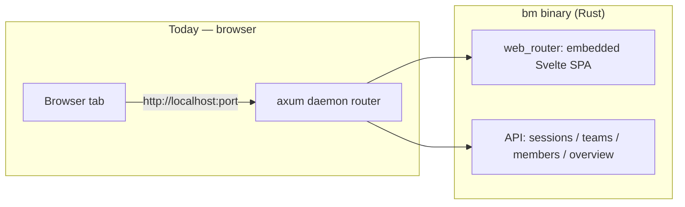
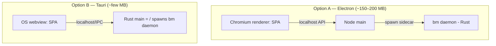

# R-01 — Can the BotMinter (`developer` loop) console run as a desktop app?

**Question (operator):** Can the BotMinter context/console work as an Electron desktop app?

**Why it matters:** The MVP is console-first (Q-14). The delivery surface for day-1 install/onboarding
depends on whether the console can ship as a desktop app vs. browser-only. This research grounds that
decision in BotMinter's *actual* console architecture (branch `squash/ct03` — the future branch).

## Findings — what BotMinter's console is today

The `bm` daemon is already a **self-contained web-server-in-a-binary**:

| Aspect | Evidence | Detail |
|---|---|---|
| Frontend stack | `console/package.json` | SvelteKit 2 / Svelte 5 / Tailwind 4 / Vite 6; CodeMirror, mermaid, marked |
| Build output | `console/svelte.config.js:1,8` | **`@sveltejs/adapter-static`** → builds to a static SPA in `console/build/` |
| Embedded in binary | `crates/bm/src/web/assets.rs:6` | `#[folder = "../../console/build/"]` (rust-embed) — the SPA is compiled **into** the `bm` binary |
| Served by daemon | `crates/bm/src/daemon/run.rs:29,244,254` | axum `Router` merges `web_router(web_state)` (`crates/bm/src/web/mod.rs:25`) — SPA + API on one router |
| Localhost HTTP | `crates/bm/src/cli.rs:340,688`; `tests/integration.rs:3290` | binds a port; tests assert `Console: http://localhost:{port}` |

**Key fact:** the SPA is already decoupled from the backend via a localhost HTTP API. A desktop app is
therefore a *window around the existing server*, not a re-architecture.

## Desktop packaging options

### Option A — Electron
- Keep the Rust `bm` daemon as-is; Electron's Node **main process spawns it as a sidecar** child
  process; the Electron (Chromium) renderer points at `http://localhost:<port>` (or loads the static
  build and calls the daemon API).
- **Pros:** minimal new code; mature ecosystem.
- **Cons:** bundles full **Chromium + Node (~150–200 MB)** and a Node runtime. This re-introduces exactly
  the heavyweight footprint the operator rejected when choosing Rust over Paperclip's TS+Postgres stack.

### Option B — Tauri (recommended)
- Tauri's **main process is Rust** and it uses the **OS-native webview** (WebView2/WebKit) — no bundled
  Chromium, no Node. Since `bm` is already Rust, the Tauri shell can host/spawn the daemon in-process and
  load the same embedded Svelte SPA in the webview.
- **Pros:** few-MB footprint; reuses the daemon + embedded SPA nearly unchanged; aligned with the
  "lightweight, minimal footprint" ethos that motivated the Rust choice.
- **Cons:** smaller ecosystem than Electron; OS-webview quirks across platforms.

## Conclusion (feeds design)

- **Feasible either way.** Because the console is an embedded SPA + localhost server, **one build supports
  browser (today), desktop (Tauri/Electron wrapper), and hosted** with almost no change. "Desktop app" is
  a packaging decision, not an architecture decision.
- **Recommended:** **Tauri**, for footprint alignment with the project's lightweight ethos. Electron is a
  viable fallback if a specific Electron-only capability or ecosystem need arises.
- **Open product decision (not a research question):** whether the MVP day-1 surface is "download the
  desktop app" or "CLI installs + opens the console in a browser," with desktop as a later wrapper. Routed
  back to idea-honing (affects Q-14).

## References
- BotMinter `squash/ct03`: `console/svelte.config.js`, `console/package.json`,
  `crates/bm/src/web/assets.rs`, `crates/bm/src/web/mod.rs`, `crates/bm/src/daemon/run.rs`,
  `crates/bm/src/cli.rs`.
- Tauri — https://tauri.app (Rust core, OS webview). Electron — https://www.electronjs.org (Chromium + Node).
