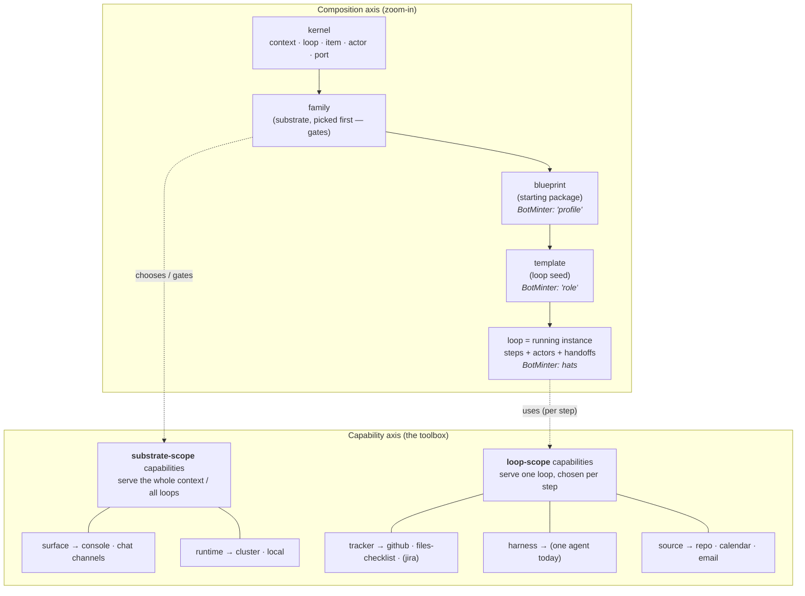

# R-02 — BotMinter as a reference instance: what varies, mapped to the domain model

**Question (operator):** Dig into an existing, working loop-management system (BotMinter, the
`agentic-sdlc-planning` profile, the engineer role) and inventory **everything that varies**. Then test
whether our emerging domain vocabulary (capability · provider · template · blueprint · family · loop)
actually describes a real system — and where the real system disagrees with it.

**Why it matters:** Loopsmith's thesis is that there is a *kernel* + a set of *variation points*.
BotMinter is the closest existing thing to "a loop you can vary." If our domain model can't cleanly
describe BotMinter, the model is wrong. If it can, BotMinter becomes the conformance target ("the kit must
be able to express something like BotMinter").

> **Scope discipline:** This document stays at the **domain / mental-model** level — *what varies* and
> *what concept each variation is an instance of*. It deliberately records **no implementation** (no module
> layout, no internal mechanics, no "how to build it"). Those are out of scope for requirement-space.

## What varies in BotMinter (the inventory)

Each row is a thing that takes more than one value in the wild, named at the concept level, then mapped to
the domain vocabulary we've been honing (Q-19 / Q-20 / Q-21 / Q-22).

| BotMinter concept | Values observed | Varies along | Domain concept it instantiates |
|---|---|---|---|
| **profile** | `agentic-sdlc-planning`, `agentic-sdlc-minimal`, `scrum` | the whole opinionated bundle | **blueprint** (a starting package) — *but see "fusion" below* |
| **role** | `engineer`, `chief-of-staff`, `sentinel` | what a loop is *for* | **template** (a loop seed) |
| **hats** | `builder`, `lead_*`, `dev_*`, `qe_*`, `cw_*`, `sre_*` | the steps within a loop, wired by who-hands-to-whom | **steps** of a loop |
| **formation** | `k8s`, `local` | where/how loops run | provider of the **runtime** capability |
| **bridge** | `rocketchat`, `telegram`, `matrix` | how humans see/reach loops | provider of the **surface/chat** capability |
| **harness** | one value in use (a single coding agent) | which agent performs a step | provider of the **harness** capability |
| **tracker** | one value in use (a GitHub board); files-checklist exists in the sibling system | where a loop's items live | provider of the **tracker** capability |
| **skills** | `github-project`, `status-workflow`, `board-scanner`, `knowledge-manager`, `epic-mgmt`, `story-mgmt` | abilities a loop draws on per step | **providers** (loop-scope) and/or composition ingredients |
| **statuses + labels** | the full workflow state set | the loop's item lifecycle | **configuration** of the tracker (the item state machine) |

## The three findings that matter for requirements

### Finding 1 — Two capabilities are *already* multi-provider; two are single-provider-by-habit

- **surface** genuinely varies: BotMinter offers several chat channels *and* a console view. "How a human
  sees and drives loops" is a real, exercised variation point.
- **runtime** genuinely varies: loops can run on a cluster or as plain local things.
- **tracker** and **harness** are real capabilities but each ships **one** provider in this instance
  (a GitHub board; one agent). They are swappable *in principle* — the sibling assistant system tracks on
  files-checklist instead — but BotMinter never exercises the swap.

→ **Domain consequence:** the capability/provider split is real and observable; it is not something we are
inventing. The MVP's job (Q-20) is to *exercise* a swap on a capability that today has only one provider —
which is exactly the github→jira tracker target (Q-22 / F-18).

### Finding 2 — A loop is steps + actors + handoffs

A BotMinter role is a named **loop** made of **hats** (steps); each step is performed by an **actor**, and
steps hand off to one another to advance an **item**. This directly confirms the kernel nouns
(loop · item · actor) and the "loop = ordered steps with handoffs" model, with no extra nouns required.

### Finding 3 — "Substrate choice" and "starting bundle" are **fused** in the wild

This is the one place BotMinter *disagrees* with our model. BotMinter has a single concept — the
**profile** — that bundles **both**:
- the substrate-level choices (which runtime, which surfaces are available), **and**
- the starting package (which roles/templates, which skills/providers, which invariants/knowledge ship).

Our model (Q-20 / Q-21) **splits** these into **family** (pick-first; *gates* what's possible) and
**blueprint** (the bundle on top of a family). BotMinter shows the fused version *works in practice*.

→ **Open domain question (feeds design):** keep the split (family vs blueprint) or adopt the fused
"profile"? The split's only justification is that it lets us express a **gate** ("this substrate forecloses
that provider" — the car-edition rule, Q-20). A gate is hard to state if the gater and the gated are the
same noun. Leaning: **keep the split**, but a blueprint may *declare* its family.

## Domain mapping (the two axes, exemplified by BotMinter)

Note the dashed edges: a **loop** draws on **loop-scope** capabilities per step; a **family** chooses (and
gates) the **substrate-scope** capabilities. This is the domain reading of the operator's "driver vs
extension by layer" intuition — one notion (**provider**) filling two **scopes** of capability.

## What this contributes to requirement-space

1. **The capability + provider model is confirmed, not invented** — a real system exhibits it (surface,
   runtime multi-provider; tracker, harness single-provider-by-habit).
2. **Capability scope (substrate vs loop) is the real distinction** behind "driver vs extension." It is a
   *domain* distinction (who the capability serves), not an implementation one.
3. **The composition ladder is real** — profile≈blueprint, role≈template, hats≈steps — with **one
   unresolved domain question**: is the substrate (family) a separate noun from the starting package
   (blueprint), or fused as one (profile)?
4. **The MVP swap target is justified** — tracker is a single-provider capability in the reference
   instance; proving a swap (github→jira) is precisely what turns "capability is swappable in principle"
   into "swappable in fact" (Q-20 / Q-22 / F-18).
5. **HOW is explicitly deferred** — turning these variation points into contracts/providers is design and
   implementation work, out of scope here.

## References

- BotMinter project (in-workspace submodule), `agentic-sdlc-planning` profile and `engineer` role:
  `projects/botminter/profiles/agentic-sdlc-planning/` — `roles/`, `formations/`, `bridges/`,
  `coding-agent/skills/`, `skills/`.
- Loop definition surface (steps + their handoffs): `projects/botminter/ralph.yml`,
  `projects/botminter/profiles/agentic-sdlc-planning/roles/engineer/`.
- Deployed bundle selection (profile + roles + workflow states): `team/botminter.yml`.
- Related: [R-01](R-01-console-desktop-packaging.md) (surface delivery), and idea-honing Q-19/Q-20/Q-21/Q-22.
