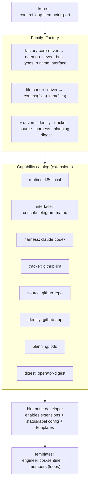

# Building a BotMinter-equivalent on Loopsmith (forward design exercise)

**Question (operator):** Not "map current BotMinter onto the model" (that's
[botminter-capability-graph.md](botminter-capability-graph.md)). Instead: **if we built a system that
delivers BotMinter's *value/features* natively on the Loopsmith model — with freedom to restructure
BotMinter's choices — what would it look like?**

> **Scope:** domain/mental-model only. Expressed as the capability graph + blueprint manifest + templates +
> journeys. No implementation (no modules, no code). Capabilities are fine-grained *where the model wants
> them*, not where BotMinter happened to hardcode them.

## Feature parity target (what the equivalent must deliver)

The same observable value as BotMinter:

| # | Feature | Must still be true |
|---|---|---|
| F-a | A **team/world** with a home source + connected project repos | context + ports |
| F-b | **Members** in **roles**, each with its own identity | actors with identity |
| F-c | The **SDLC loop**: plan → implement (TDD) → review → QE → merge-gate | the engineer/sentinel work |
| F-d | A **tracked workflow** (issues, statuses, labels, gates) | tracker |
| F-e | Members **coordinate** through the tracker | event-bus + shared tracker (Round 3) |
| F-f | Run members **on a cluster or locally** | runtime |
| F-g | **Console + chat** surfaces | interface |
| F-h | Proactive **operator digest / 1:1 chat / escalation** | digest (brain) |
| F-i | **Event-driven** orchestration (restart on events) | the daemon |
| F-j | **Bootstrapping**: create team, identity, board, hire, start | onboarding journey |

## Assumptions (externalized — veto any)

- **A-1** This equivalent sits on the **Factory** family (heavy: daemon-backed) — it's the BotMinter side
  of the two-family world; Base = Wazeer, out of scope here.
- **A-2** I fine-grain a capability **only** where parity needs swap/optionality or where R-03 flagged a
  coarse spot worth fixing. Otherwise coarse-bundle (your granularity rule).
- **A-3** "skills" are *not* a domain noun here; an ability a loop uses is either an **extension** (binds a
  capability) or just carried prompt/knowledge. (Resolved earlier.)
- **A-4** Identity is worth promoting to its own capability (R-03 showed BotMinter bakes GitHub-App-per-
  member into `hire`). *(challenge if overkill)*

## The build — layer by layer

> **Model clarification (Round 4):** any node (driver *or* extension) is a `requires`/`provides` graph entry
> and may `provides ∈ {new capability type, thing-of-a-type, infra}`. **driver vs extension = which layer
> ships it** (a driver is bundled *by a family*; an extension is enabled *on* a blueprint/loop) — *not* what
> it provides.

### kernel
Seeds `cap:context · cap:loop · cap:item · cap:actor · cap:port`. Ships specs + world-building skills.

### Family: **Factory** — drivers (`requires` → `provides`)

`requires` names concrete modules (kernel is the implicit base, so kernel caps aren't listed). A
**type-introducing driver requires nothing and provides exactly one type** (Round 15); the two **substrate
drivers** (`factory-core`, `file-context`) provide *infra / a constant* instead. The real cross-module
`requires` live on the **extensions** (next table).

| Driver                | Description                                                                                             | requires (modules)                       | provides (infra)          | provides (types)                                       |
| --------------------- | ------------------------------------------------------------------------------------------------------- | ---------------------------------------- | ------------------------- | ------------------------------------------------------ |
| `factory-core-driver` | Heavy substrate: the always-on daemon + event bus that schedule, watch, and restart loops               | — *(kernel base)*                        | daemon · event-bus        | `runtime` · `interface`                                |
| `file-context-driver` | Gives a context a **file home** (team/home source) + file items; the knowledge/invariants/skills layering| — *(kernel base)*                        | archetype/layer mechanism | *(none — fills kernel `context`/`item`, files flavor)* |
| `identity-driver`     | Introduces the **`identity` type** — the slot for a per-actor credential an actor acts as (no concrete credential of its own) | — *(kernel base)*                        | —                         | `identity`                                             |
| `tracker-driver`      | Introduces the slot for *where a loop's items are tracked*                                              | — *(kernel base)*                        | —                         | `tracker`                                              |
| `source-driver`       | Introduces **typed external contexts** reached over a port (authority/disclosure dials)                 | — *(kernel base)*                        | —                         | `source`                                               |
| `harness-driver`      | Introduces the slot for *which agent executes a step*                                                   | — *(kernel base)*                        | —                         | `harness`                                              |
| `planning-driver`     | Introduces the **`planning` type** — the slot/contract for a planning engine (no concrete pipeline of its own) | — *(kernel base)*                        | —                         | `planning`                                             |
| `digest-driver`       | Introduces the **`digest` type** — the slot/contract for a proactive operator-digest engine             | — *(kernel base)*                        | —                         | `digest`                                               |

### Capability catalog (extensions — fine-grained on purpose)

`requires` names concrete modules — at minimum the **type-driver** that `provides` the extension's type,
plus any cross-edges to other extensions (alternatives written `a | b`). Kernel is implicit; outside-world
facts (a cluster exists, you own an email account) are deployment prerequisites, not model edges.

| Extension | Of type | Description | requires (modules) |
|---|---|---|---|
| `k8s` | `runtime` | Runs each loop as a pod on a Kubernetes cluster | `factory-core-driver` |
| `local` | `runtime` | Runs each loop as a local process | `factory-core-driver` |
| `console` | `interface` | Built-in web UI surface: digests, chat, loop views | `factory-core-driver` |
| `telegram` | `interface` | Operator chat over Telegram | `factory-core-driver` |
| `matrix` | `interface` | Operator chat over Matrix | `factory-core-driver` |
| `rocketchat` | `interface` | Operator chat over Rocket.Chat | `factory-core-driver` |
| `claude` | `harness` | Executes a step using the Claude Code agent | `harness-driver` · (`k8s` \| `local`) |
| `codex` | `harness` | Executes a step using the Codex agent | `harness-driver` · (`k8s` \| `local`) |
| `github` | `tracker` | Tracks items as issues on a GitHub Projects board (statuses/labels = the workflow) | `tracker-driver` · `github-app` |
| `jira` | `tracker` | Tracks items as Jira issues | `tracker-driver` · `jira-cred` |
| `github-repo` | `source` | Connects an external GitHub repo as a typed context (fork/PR/issues verbs) | `source-driver` · `github-app` |
| `calendar` | `source` | Connects a calendar as a read-only context *(post-MVP)* | `source-driver` · `calendar-cred` |
| `email` | `source` | Connects an email account as a read-only context *(post-MVP)* | `source-driver` · `email-cred` |
| `github-app` | `identity` | Per-actor GitHub App identity; the actor acts as it for board + repo ops | `identity-driver` · `factory-core-driver` |
| `jira-cred` | `identity` | Per-actor Jira credential | `identity-driver` · `factory-core-driver` |
| `pdd` | `planning` | The epic→story→code-task PDD pipeline (idea-honing → design → breakdown) | `planning-driver` · `file-context-driver` · (`github` \| `jira`) |
| `operator-digest` | `digest` | The "brain": cross-context digest, 1:1 operator chat, escalation on stuck loops | `digest-driver` · `factory-core-driver` · (`github` \| `jira`) · (`console` \| `telegram` \| `matrix` \| `rocketchat`) |

### Blueprint: **`developer`** (on Factory)

The manifest that *is* the BotMinter-equivalent. A blueprint declares **intent** (the *leaf* extensions it
wants); the kit then **resolves the `requires`-closure** and the **family gates** it (apt/dnf style):
- **declared intent (leaves):** `{k8s|local, console+telegram, claude, github (tracker), pdd (planning),
  operator-digest (digest)}`
- **auto-pulled by closure (Rounds 1, 13, 14, 15 — all module-level):** `github` → `tracker-driver` ·
  `github-app` → (`identity-driver` · `factory-core-driver`); `claude` → `harness-driver` · (`k8s` |
  `local`); `pdd` → `planning-driver` · `file-context-driver` · (`github` | `jira`); `operator-digest` →
  `digest-driver` · `factory-core-driver` · (`github` | `jira`) · (`console` | `telegram` | …). The operator
  lists only the leaves; the resolver walks the modules.
- **family gates by ABSENCE (Round 6):** a family forecloses a capability by simply **not loading the driver
  that introduces its type** (no daemon → no `runtime` type → `k8s` unavailable). No `excludes` rules.
- **tracker config:** the SDLC **status graph + labels** (triage → plan → breakdown → implement → verify →
  merge → done, with the human gates). *This is configuration of the `github` tracker extension*, not new
  code.
- **ships templates:** `engineer` · `chief-of-staff` · `sentinel`.

### Templates (loop seeds) → members (running loops)

| Template | Hats (steps) | Capabilities it binds |
|---|---|---|
| `engineer` | po_gate · lead_plan-create · lead_plan-review · lead_breakdown · lead_monitor · dev_implement-{plan,red,green,refactor,review} · qe_{verify,investigate,monitor} · sre_setup · cw_{write,review} | tracker(github) · harness(claude) · planning(pdd) · source(github-repo) |
| `chief-of-staff` | scan · digest · operator-chat · escalate | digest · interface · tracker |
| `sentinel` | merge-gate · orphan-triage | tracker · source(github-repo PR) · harness |

A **member** = an instantiated, running template. Loops are wired by the daemon's **event bus** (hats'
triggers/publishes); coordination across members happens **through the tracker** (F-e).

### Bootstrapping journey (Smith-driven — replaces `bm init/hire/start`)

1. CLI installs → launches **console**; **Smith** onboards conversationally.
2. Create the **context** (team) with a home source; pick **family = Factory**, **blueprint = developer**.
3. Guided **tracker connect** (GitHub board) — which is the **`github-app` identity** + **`github` tracker**
   extension onboarding (the `bm init` GitHub-App flow, now framed as enabling two extensions).
4. **Hire** actors from templates (engineer/cos/sentinel) — each gets a `github-app` **identity**.
5. Smith **reconciles** desired-state → loops running, healthy; dual-verify. (F-j)

## What changes vs current BotMinter (freedoms taken)

| Δ | Change | Why |
|---|---|---|
| Δ-1 | **`tracker` becomes a real capability** (github/jira swappable) | BotMinter hardcodes github; this is the MVP thesis |
| Δ-2 | **Family extracted from "profile"** → `developer` blueprint *on* Factory family | makes the substrate gate explicit (R-03 A-04); enables a future Base |
| Δ-3 | **`identity` becomes a capability** (`github-app` one extension) | BotMinter bakes GitHub-App-per-member into `hire`; decouple to allow non-GitHub identity |
| Δ-4 | **`planning` + `digest` promoted to explicit capabilities** | BotMinter ships them as implicit `skills/`+`specs/`+`brain/`; explicit = opt-in/swappable per blueprint |
| Δ-5 | **`source`/port enriched with authority + disclosure dials** | BotMinter projects are coarse `{name, fork_url}` |
| Δ-6 | **Bootstrapping via Smith + console/designer** | replaces `bm init/hire/start` CLI choreography (CLI may remain as an `interface` extension) |
| Δ-7 | **`interface` unifies console + bridges** | BotMinter has console built-in + a separate bridges catalog; one capability |

## Open questions for you

1. **Identity (Δ-3)** — *Round 1 leans **yes, promote***: one `github-app` identity is shared by
   `tracker:github` + `source:github-repo`; folding it into either would block reuse. Confirm?
2. **planning + digest as capabilities (Δ-4)** — *Round 2: **coarse for MVP***, promote to types only when a
   2nd engine is wanted. Agree, or do you want them swappable from day one?
3. ~~**multi-agent** — capability or not?~~ **Resolved (Round 3): not a type** — it's event-bus + >1 loop +
   shared tracker.
4. Is `developer` the right single blueprint, or do we want a thinner BotMinter-equivalent blueprint that
   omits `digest`/`planning` (mirroring `agentic-sdlc-minimal`)?

## Refinement rounds

> Iterative, one weak spot per round. Each round: focus → check (code if useful) → change. History kept.

### Round 1 — dependency edges + blueprint closure (the graph was too loose)
**Weak spot:** the one-shot catalog listed extensions but **omitted their `requires` edges**, and treated
the blueprint as "a list of enabled extensions" rather than a **closed, dependency-resolved set**.

**Check (code):** the GitHub identity is a **GitHub App per member** (`credential_keys::app_id(member)`);
its installation token (`exchange_for_installation_token`) is the single `GH_TOKEN` used for **both** board
operations *and* repo/PR operations. → **one `identity:github-app` (per actor) underpins both
`tracker:github` and `source:github-repo`.**

**Change:**
- Added a **`requires`** column to the extension catalog (below). Key cross-capability edges:
  `tracker:github → identity:github-app`; `source:github-repo → identity:github-app`;
  `identity:github-app → identity-driver`; `operator-digest → digest-driver (interface+multi-agent)`.
- Reframed the blueprint: **a blueprint declares *intent* (the leaf extensions it wants); the kit resolves
  the `requires`-closure** (enabling `github` tracker auto-pulls `github-app` identity), and the **family
  gates** it (excludes what Factory forbids). This is the apt/dnf dependency-resolution move.
- This is also the **cleanest justification for Δ-3** (identity as its own capability): one App identity is
  *shared* by two capabilities (tracker + source). If identity were folded into tracker, source couldn't
  reuse it. → Open-Q1 leans **yes, promote identity**.

### Round 2 — separate "model CAN fine-grain" from "the MVP fine-grains" (scope honesty)
**Weak spot:** the one-shot fine-grained **everything** into capability types. That conflates *what the
model can express* with *what this build actually needs* — and silently inflates MVP scope. Your granularity
rule says introduce a type only when you want 0..N swappable things *now*.

**Change — classify every capability by why it's a type:**

| Capability | Type needed because… | MVP status |
|---|---|---|
| `tracker` | **the swap is the whole point** (github↔jira) | **fine-grain — MVP core** |
| `runtime` | parity needs k8s *and* local | fine-grain (already a catalog) |
| `interface` | parity needs console *and* chat | fine-grain (already a catalog) |
| `harness` | already a catalog; ≥2 trivially | fine-grain (cheap) |
| `identity` | shared by tracker+source (Round 1) | **type yes, but n=1** (`github-app`) for MVP |
| `source` | typed external contexts + dials | type yes, **n=1** (`github-repo`) for MVP |
| `planning` | one engine (pdd) suffices now | **coarse-bundle** for MVP; type later |
| `digest` | one engine suffices now | **coarse-bundle** for MVP; type later |

→ **MVP truly fine-grains one capability for the *swap* (`tracker`)**; `runtime/interface/harness` come
fine-grained for free (already catalogs); `identity/source` are types-with-one-provider (cheap, and Round 1
shows identity *must* be a type to be shared); `planning/digest` stay coarse until a second engine is wanted.
This shrinks the MVP claim from "fine-grain 8 capabilities" to "**prove the type+swap machinery on
`tracker`, with the catalog pattern reused for the free ones.**"

### Round 3 — `multi-agent` dissolves (answering Open-Q3)
**Weak spot:** I carried `multi-agent` as a capability type (factory-core introduced it; planning/digest
required it). But what does it actually *provide* that's distinct? Coordination.

**Check (code):** coordination is real but is **two existing things**, not a third capability:
(1) an **event bus** — hats have `publishes:`; `events.jsonl` + `brain/event_watcher` consume them; a live
workspace shows `current-events` + dozens of `events-*.jsonl`; and (2) the **shared tracker** (item state on
the board). There is no separate "multi-agent" mechanism.

**Change:**
- **Drop `multi-agent` as a capability.** It dissolves into: **event-bus** (infra from `factory-core`) +
  **>1 loop in the context** + **shared tracker**. "Multi-agent" is an *emergent property*, not a slot.
- `factory-core-driver` now provides **infra: daemon + event-bus**; **types: runtime, interface** (only).
- `planning`/`digest` now require **"a coordinating context" (event-bus + tracker)**, not `multi-agent`.
- → Open-Q3 resolved: **no `multi-agent` type.** Fewer speculative nouns; the model gets simpler under
  scrutiny (a good sign).

### Round 4 — the driver/extension definition BENT (⚠ biggest hit so far)
**Weak spot:** my baseline said *"drivers introduce capability types; extensions are things-of-a-type."*
But your own Fedora example has an **extension introduce a type**: `coding-agent-mcp-extension` (requires
`coding-agent-driver`) *"extends the capabilities with mcp."* And in k8s, **operators routinely ship their
own CRDs** — installing a Kind is not reserved to "core."

**Change (model refinement, ⚠ not collapse):**
- **Any module is a node in the `requires`/`provides` graph; `provides ∈ {new capability TYPE, thing-OF-a-
  type, infra}` — for *both* drivers and extensions.** "Introduces a type" is **orthogonal** to driver-vs-
  extension.
- So what *is* the driver/extension line? **Provenance/layer, not what it provides:** a **driver** is shipped
  *by a family* (part of what makes the family); an **extension** is *enabled on* a blueprint/loop (on top of
  a family). A chain like `harness-driver` → `mcp-extension` (introduces `cap:mcp`) → `some-mcp` (of `mcp`)
  is now expressible — it wasn't under the rigid baseline.
- This is the **biggest bend** in the stress test. The model survives but its core definition had to move
  from "what it provides" to "which layer ships it."

### Round 5 — not everything a loop uses is a capability (bare abilities)
**Check (code):** the engineer carries skills `{adr, member-tuning, process-evolution, retrospective,
role-management, team-design, verification}` — none bind tracker/harness/etc.; they're **bare abilities**.

**Change:** the capability/extension axis is for things you'd **swap** or that need a **contract**. An
ability with neither is **carried template content** (prompt/knowledge/skill), *not* an extension. → applies
the granularity rule to abilities: *promote to a capability only when you want optionality.* No collapse; a
scoping clarification. (Avoids the vacuous "everything is a capability.")

### Round 6 — gating is by ABSENCE, not `excludes` (⚠ refutes a Q-20 claim)
**Check (code):** grep for `conflict|exclude|incompatible|mutually` across config/code → **no declared
mutual-exclusions** (only unrelated hits: board-view filter, HTTP 409, session cleanup).

**Change:** the model needs **only `requires` + which drivers a family loads.** A family forecloses a
capability simply by **not loading the driver that introduces its type** (Base has no daemon → no `runtime`
type → `k8s` can't be enabled — *absence*, not conflict). → **No `excludes`/conflicts edge is evidenced.**
This **refutes Q-20's "the heavy family *excludes* files-checklist tracker"**: Factory has `file-context`, so
files-checklist *could* run — it's just not shipped. The "constrained space" is constrained by **dependency
+ absence**, not by exclusion rules. (Watch item: if a *true* either/or ever appears, revisit — none found.)

### Round 7 — `port` ≠ topology (a mapping correction) + the fork chain
**Check (code):** `topology::Endpoint` is `Local{pid,workspace}` | `K8s{pod,…}` — i.e., **runtime
placement** (where a member runs), which belongs to `cap:runtime`, **not** `cap:port`. My R-03 Pass 5
mis-assigned it.

**Change:**
- **Correction:** `cap:port` is realized *only* by `projects/` + `fork_url` (even coarser than R-03 said);
  `topology` is `runtime` placement. (R-03 Pass 5 corrected accordingly.)
- **Fork chain (Q-07) expressibility:** a context can be a **home** context (you run its loop) *and* a
  **source** (external) to another context — same node, different relationship. `openshift/hs →
  devguyio/hs → bot-squad/hs` = a port chain where each hop carries an `identity` (Round 1: identity is its
  own capability, per-actor) → the chain is expressible as **port edges + per-hop identity**. Holds ✓.

### Round 8 — "loops all the way down" (reconcile is just a loop)
**Observation across passes:** reconcile shows up at three levels — the **daemon** (desired vs actual member
placement), the **shepherd** hat (story gap reconciliation), and **Smith onboarding** (Loop-Studio desired-
state → running loop). Plus *a formation is itself a loop* (R-03 Pass 4).

**Verdict:** **no new noun.** A reconcile loop is *a loop whose items are "desired vs actual" deltas* — a
**template pattern**, not a capability. The fractal (loops running loops, loops reconciling loops) is a
property the model already supports. Holds ✓ — and it's evidence the kernel `loop` noun is load-bearing.

### Round 9 — Δ audit (does any freedom regress parity?)
Re-checked each Δ against the 10 parity features: Δ-1 (tracker type) ✓ upgrade; Δ-2 (family split) ✓; Δ-3
(identity capability) ✓ justified by Round 1; Δ-4 (planning/digest explicit) ✓ optional; Δ-5 (port dials) ✓;
Δ-6 (Smith bootstrap, CLI stays an `interface`) ✓; Δ-7 (unified `interface`) ✓. **No Δ regresses parity** —
each is an upgrade or neutral. (Δ-4's "as capabilities" is model-capacity; Round 2 keeps them coarse by
default.)

### Round 10 — Base/Wazeer family: is the family layer *necessary*? (projected — Wazeer not in workspace)
**Setup (from known facts, no code here):** Base = no daemon, no event-bus, CLI/Obsidian interface,
`files-checklist` tracker, single-user (loop-as-skill `/ping`), git home source for versioning.

**Model:** Base family loads `{base-core-driver (CLI interface, no daemon → no runtime/event-bus types),
file-context-driver, files-checklist tracker}`. **Foreclosure check:** the `developer` blueprint declares
`k8s-runtime`, which `requires` the `runtime` type, which only `factory-core-driver` introduces. Base never
loads factory-core → `runtime` type absent → `k8s-runtime` **cannot resolve** → **`developer` cannot
instantiate on Base.** ✓ Gating-by-absence works *and* is the thing that makes "k8s unavailable here"
expressible.

**But is "family" a *necessary* concept, or just sugar?** Honest answer: the *mechanism* is only
`requires` + which-drivers-are-loaded (R6). **"Family" is the necessity of a *named, curated, pick-first
driver-set*** — coherence + reuse + the "choose substrate first" UX. Without naming it you'd hand-assemble
drivers per deployment. So family ≠ blueprint **stands** (family = substrate driver-set; blueprint =
extensions+templates on top), and its necessity is **real but is coherence/UX, not a new primitive.** This
is the cleanest closure on R-03's open caveat: the split is justified, just don't oversell "family" as a
distinct *mechanism*.

### Round 11 — actor-swap (D-iii) depth: per-step, or only gate hats?
**Check (code, prior passes):** most engineer hats are agent-run; `po_gate` is the human gate (waits for a
human decision via GitHub comments / interface). No code path "flips" an arbitrary running step to a human.

**Verdict:** D-iii ("a step's actor is swappable human↔agent") holds **at design time** — a template author
chooses, per step, agent-run vs a human gate (= a `touchpoint`). It is **not a live runtime toggle** in
BotMinter. The model's `cap:actor(human|agent)` per step is expressible; the "swap" is *configuring a gate
hat*, not hot-swapping a performer. Nuance on D-iii's strength, not a collapse. (Human-actor = touchpoint =
context gap — consistent with the kernel claim.)

### Round 12 — walk the jira swap through the closure (the headline capability)
**Trace:** enable `jira` of `cap:tracker`. Resolver: `jira → tracker-driver` (type already present) `+
identity:jira` (new extension of `cap:identity`, the per-actor jira credential). It pulls `identity:jira`;
nothing else. The engineer template's hats that bound `cap:tracker` now bind the `jira` extension; the
status/label config moves to jira's projects. **Nothing structural changes** — no kernel edit, no family
edit, no new capability *type* (tracker already exists). ✓ Confirms the swap = {new `identity:jira` + `jira`
tracker extension + re-point the binding}. The whole loopsmith thesis reduces to **"make `tracker` a type
the way `runtime/interface/harness` already are, and this trace just works."**

### Round 13 — audit every `requires`/`provides` against the real vocabulary
**Weak spot (operator caught it):** `planning-driver` / `digest-driver` listed `requires: "coordinating ctx
(event-bus + tracker)"` — **prose, not a capability.** Leaked in when Round 3 dissolved `multi-agent` and I
substituted a phrase instead of resolving to concrete edges.

**Rule enforced:** every `requires` must be one of — a **kernel cap** (`context/loop/item/actor/port`), an
**infra** (`daemon`, `event-bus`), a **type** (`runtime/interface/identity/tracker/source/harness/planning/
digest`), or a named driver/extension. Every `provides` is **infra** or a **type** (or, for file-context, a
flavored instance of a kernel type).

**Corrections made to the live tables:**
- `planning-driver`: requires **`file-context` + `tracker`** (PDD writes spec files *and* creates tracked
  stories) — it never needed event-bus/“coordination.”
- `digest-driver`: requires **`interface` + `tracker` + `event-bus`** (reads board state, watches events,
  reaches the operator) — concrete, replacing the prose.
- `identity-driver`: requires **`daemon`** (the per-actor token minting is daemon-backed; this is what makes
  identity Factory-specific).
- `tracker-driver` requires kernel **`item`**; `source-driver` requires kernel **`context`+`port`**;
  `harness-driver` requires kernel **`actor`** — introducing a *type* depends only on the kernel noun it
  slots against, not on `file-context` (my earlier guess was too eager).
- Extension cross-edges made explicit and de-duped: an extension implicitly requires *its own type*; the
  catalog now lists only the **non-obvious** edges — `harness:* → runtime` (an agent runs *in* a runtime),
  `tracker:github → identity:github-app`, `source:github-repo → identity:github-app`, `identity:github-app →
  daemon`, `runtime:k8s → (external cluster)`.

No model change — this is **hygiene**: the graph now type-checks (no dangling prose edges).

### Round 14 — `requires` targets must be concrete modules (operator directive)
**Weak spot:** edges pointed at *abstract* things — a kernel cap (`item`), a bare type (`runtime`), an infra
word (`daemon`). The graph wasn't homogeneous, and there was no *module-level* structure to classify driver
vs extension.

**Rule:** **every `requires` names one or more concrete modules — drivers and/or extensions** (alternatives
written `a | b`). The **kernel is the always-present base**, so kernel-cap dependencies are *implicit* and
not listed. Abstract targets are rewritten to the module that provides them: `daemon` → `factory-core-driver`;
`runtime` → `k8s | local`; `interface`/`event-bus` → `factory-core-driver`; `tracker` (as a dep) →
`tracker-driver`.

**Payoff — a crisp driver/extension classifier finally exists:**
- an **extension** always requires *at least its type-driver* (the module that `provides` its type);
- a **driver** requires only *other drivers* (never an extension — preserves the layering).
- *(Caveat: an extension that itself `provides` a new type — the `mcp-extension` case from R4 — would blur
  this. None in the BotMinter build do, so here the classifier is clean. R4's "provenance" framing remains
  the general rule; this is the concrete test for the common case.)*

Applied to both tables + the blueprint closure below.

### Round 15 — a type-driver introduces ONLY the slot; concrete deps live on extensions (operator catch)
**Weak spot:** `planning-driver` was described as "a PDD pipeline" and required `file-context` + `tracker`;
`digest-driver` baked in the concrete digest behavior; `identity-driver` baked in daemon-minted credentials.
That conflates **introducing a type** with **shipping one concrete impl of it** — which would block having a
*second* planning/digest/identity later (scrum-planning, kanban-planning, a PAT identity, …).

**Rule:** a **type-introducing driver** introduces *only the type (slot/contract)* and carries **no concrete
impl and no concrete deps** (requires = kernel base). **Every concrete impl is an extension, and the real
`requires` live on the extension.** Two **substrate drivers** (`factory-core`, `file-context`) are the
exception — they legitimately provide *infra / a constant* (the daemon, the file home), which is singular
substrate, not a typed impl with alternatives.

**Changes:**
- `planning-driver` / `digest-driver` / `identity-driver` → slot-only; `requires` = — *(kernel base)*;
  descriptions rewritten to the contract.
- Concrete deps moved onto the extensions:
  - `pdd` (planning) now requires `planning-driver` · `file-context-driver` · (`github` | `jira`) — writes
    specs to the file home and creates stories on *a* tracker.
  - `operator-digest` (digest) now requires `digest-driver` · `factory-core-driver` (event-bus) · (`github`
    | `jira`) · (`console` | `telegram` | `matrix` | `rocketchat`).
  - `github-app` / `jira-cred` (identity) now require `identity-driver` · `factory-core-driver` (daemon-
    backed minting/keyring).
- **Now all six type-drivers are uniform** (require nothing, provide exactly one type) — which also makes the
  Round-14 classifier sharper: *type-driver = provides one type, requires nothing; substrate-driver =
  provides infra; extension = provides a thing-of-a-type, carries the real deps.*

## Verdict — full stress test (Rounds 1–15): **model HOLDS, with 1 real bend and 2 simplifications**

All 10 parity features map; the model expressed a complete BotMinter-equivalent. But "all the way" surfaced
genuine pressure — recorded honestly:

**1 real bend (⚠):**
- **R4 — the driver/extension definition moved.** It is **not** "drivers introduce types, extensions don't."
  *Any* node can introduce a type; **driver vs extension = which layer ships it** (family-bundled vs
  enabled-on-top). Your own `mcp-extension`-introduces-`mcp` example forced this. The model survived only by
  relocating its core distinction from *what-it-provides* to *provenance*.

**2 simplifications (model got smaller under scrutiny — a good sign):**
- **R3 — dropped `multi-agent`** (it's event-bus + >1 loop + shared tracker).
- **R6 — dropped `excludes`/conflicts** (gating is `requires` + driver **absence**; refutes Q-20's
  "factory excludes files-checklist").

**2 corrections (mapping, not model):**
- **R7 — `topology` is runtime placement, not `port`** (R-03 Pass 5 fixed). `cap:port` = `projects/`+forks
  only.
- **R5 — bare abilities are carried template content, not extensions** (promote only for optionality).

**Held without strain:** kernel nouns (R-03), family/blueprint split (R-03 A-04), the `requires`-closure +
identity sharing (R1), human-actor-as-touchpoint-gate (implied by po_gate), the fork chain (R7), and
**"loops all the way down"** — reconcile/formation/onboarding are all just loops (R8).

**No fatal collapse found.** The model expresses every BotMinter feature and every divergence is an upgrade,
not a patch.

**Closure on the family caveat (R10):** the Base/Wazeer projection shows `developer` is genuinely foreclosed
from a no-daemon substrate (gating-by-absence), so family ≠ blueprint is **justified** — with the honest
caveat that "family" is a *named curated driver-set* (coherence/UX), not a distinct gating *mechanism*.

**All originally-listed stress targets now run:** Base/Wazeer family (R10), actor-swap depth (R11), jira
swap walkthrough (R12).

## Net result of the full stress test
The capability dependency-graph model **survives end-to-end** against a real system. It **shrank** under
pressure (no `multi-agent`, no `excludes`) and its **one core definition shifted** (driver/extension =
provenance, not what-it-provides). The headline thesis reduces to one sentence:

> **Make `tracker` a capability *type* the way `runtime` / `interface` / `harness` already are; then a
> github→jira swap is just `{+identity:jira-cred, +jira (tracker), re-point the binding}` — no kernel, family, or new-type
> change.**

Residual honest limits (not collapses): family necessity is *coherence/UX* not mechanism (R10);
actor-swap is *design-time* not live (R11); Wazeer was *projected*, not code-verified (R10).
