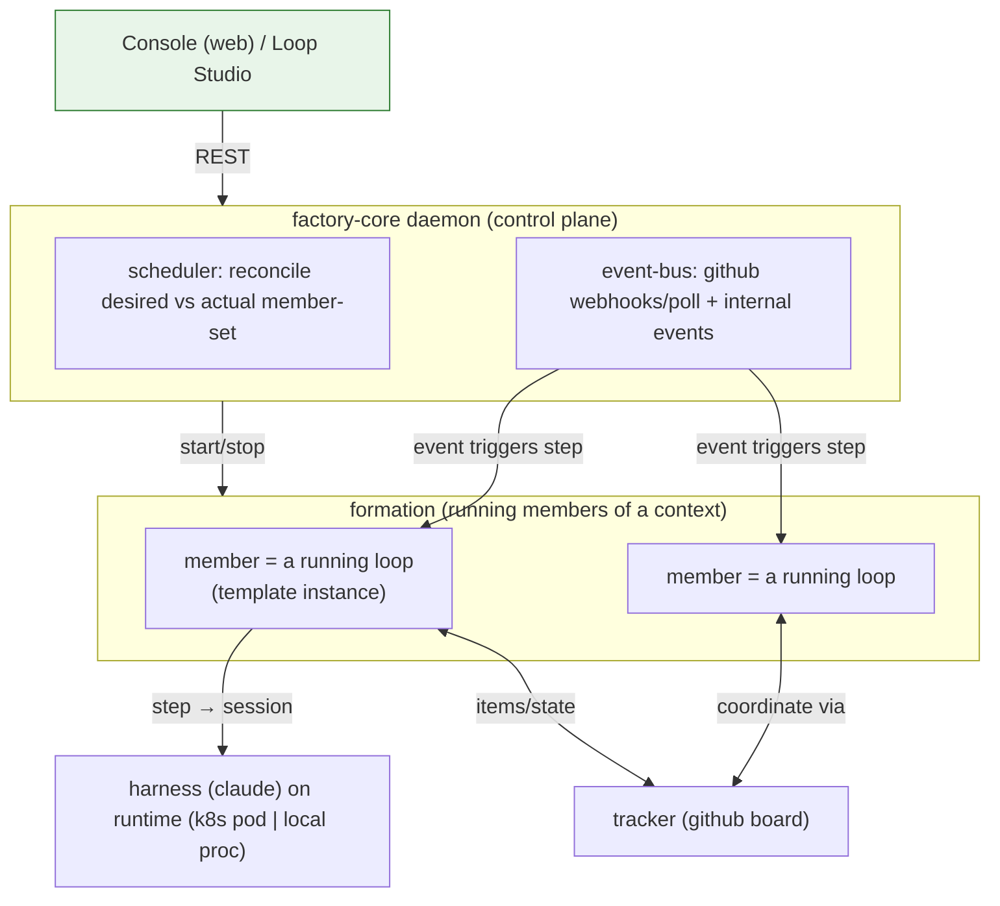
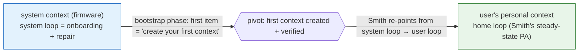
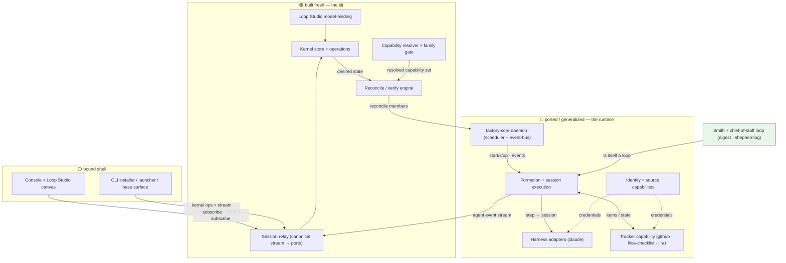

# R-06 — First Product: the `developer` blueprint runtime (archived)

**What this is.** This document is the **product** design — the runtime architecture and components of the BotMinter-equivalent `developer` blueprint — **archived out of `design.md`** when epic #1 was re-centered on building **the firm** (the consultancy: conformance contracts + packaging grammar + the packaging practice + the catalogue), not its first product.

**Why it's here, not in the design.** #1 builds the firm. The `developer` blueprint (this runtime) is the firm's **first engagement / first product**: the firm runs its practice to package BotMinter's existing backend (`squash/ct03`) into a conforming `developer` blueprint. This document is **input to that engagement**, not a thing the firm's design specifies. As the firm packages BotMinter, every point of resistance is recorded in the friction log — and *that* is the firm-level deliverable. We do not design the daemon/formation here; BotMinter already has them. We design the firm packaging them (see `design.md` §3–§5).

**Status.** Retained verbatim as captured. Section numbers and `§`-cross-references below point to the **historical** `design.md` structure (pre-recast) and to sibling research files relative to the original design-doc location (`research/R-0x` → `R-0x` from here). Treat as reference, not as live spec.

---

## The Implementations

### 3.7 Developer blueprint — runtime architecture (the ported backend)

For the **factory** family, the runtime is BotMinter's proven backend, generalized:

A **loop** runs as a **formation member**; each step executes as a **session** through the bound harness, placed by the runtime extension (k8s pod or local process — this is `topology`, *not* `port`; R-03 Round 7). Members **coordinate through the shared tracker + event-bus** — there is no separate "multi-agent" mechanism (R-03 Round 3). For the **base** family there is **no daemon**: a loop is a CLI/skill invocation (`/ping`) over the files-checklist tracker; "scheduling" is the user (or cron) running the skill. The daemon's own scheduler is itself a **reconcile loop** (desired vs actual placement) — one instance of "loops all the way down" (R-03 Round 8).

### 3.8 Developer blueprint — self-hosting and the bootstrap pivot

Loopsmith stands itself up the same way it stands up user work — as a loop (PD-02). It ships a built-in **system context** (the control plane: `factory-core` daemon + event-bus) that hosts the **system loop**: bare, immutable **firmware** for onboarding and repair, depending on nothing the user can break (the floor-depends-on-nothing rule).

**Onboarding is the system loop's bootstrap phase** — a loop whose first item is "create the first context" — which **pivots** into steady-state (digest / shepherding). The persona **Smith** is portable (skills/knowledge/prompt) and bound to a loop **by a harness**; the **home loop** is a movable pointer designating the user's PA. Onboarding re-points Smith from the system loop to a real user loop — the seam the mockup sells as "same Smith, no rebrand" (S7). In steady state Smith is *hosted in* the personal context and a *member of* the others, so the cross-context digest works by **membership, not elevation** (PD-04). Emergency mode (post-MVP, but the architecture must not preclude it) rebinds the system persona onto a bare loop + a core harness; the only hard dependency is *a running LLM* (PD-03).

### 3.9 Where the work lands

Mapping the three-way split (§1.5) onto this architecture:

- **Built fresh:** the kernel (§3.2) as structured data; the capability/module **resolver** and family **gating** (§3.4); the generalized **reconcile/verify engine** (§3.8, generalizing the daemon-reconcile + shepherd + onboarding into one loop pattern); the `files-checklist` and `jira` tracker extensions; the authoring scaffolds (CLI/skill).
- **Ported/generalized:** the runtime (§3.7) — daemon, event-bus, formations, sessions, git, brain, bridges — and `ProfileManifest` → family/blueprint decomposition.
- **Bound:** the existing Loop Studio + console mockup shell to the real kernel and daemon REST.

### 3.10 Porting method: the factory family is dogfooded, with a friction log

**Decision (D-NN, to be formalized in §8).** The `factory` family is delivered by **porting and adapting BotMinter** (the `squash/ct03` backend) to conform to the kernel — *deliberately*, not for expedience. Forcing a real, proven system through the kernel is the primary test of whether the abstraction is right: where BotMinter resists the kernel is exactly where the kernel/capability model is wrong, incomplete, or over-built. This is dogfooding the kit against the system it generalizes.

**The friction log.** Every point of resistance hit while porting — a BotMinter concept that doesn't map, a capability the model can't express, a place the kernel forces an awkward shape, a piece of the model nothing needs — is recorded in [friction-log.md](../archive/friction-log.md) **as it is hit**, not reconstructed afterward. Each entry names: the BotMinter concept, the friction (what resisted and why), and the disposition (change the kernel/capability model · accept and adapt · defer post-MVP). The friction log is a **first-class output of the MVP**, on equal footing with the code: it is the evidence stream that drives the kernel and capability decisions (§8), and the operator's instrument for *feeling* where the abstraction strains rather than having it smoothed over.

**Scope note.** The MVP conformance spine is exactly two families — `factory` (ported BotMinter) and `base` (simple-assistant) — which together carry the D-i tracker-agnosticism proof. Other systems (e.g. an independent K8s-native control plane) are **candidate future families**, out of MVP scope.

## 4. Components and Interfaces

This section names the components, their responsibilities, the contracts between them, and their provenance (🟢 built fresh · 🔵 ported/generalized · ⚪ bound mockup shell). It describes *what each component is accountable for and what crosses its boundary* — not how it implements that internally. The dividing line between a **kernel concern** (substrate-independent) and a **capability concern** (swappable) is load-bearing: it is what makes the two blueprints conform to one model.

### 4.1 Component map

The remaining subsections take each component in turn. The two that carry the most new design weight — the **session relay** (§4.7) and the **Smith / chief-of-staff loop** (§4.10) — are treated at most length, because they are where the BotMinter mechanisms are reframed rather than ported as-is.

### 4.2 Kernel store and operations 🟢

**Responsibility.** Hold the five nouns — `context · loop · item · actor · port` — as validated structured data, and expose the operations that manipulate them. The kernel is the one component that knows nothing about GitHub, Kubernetes, or Claude; every concrete concern reaches it only as a typed capability binding. It is the single source of *desired state* that the reconcile engine consumes.

**Contract.** The kernel exposes operations, not a schema-free document store. The operation surface is the verb set the two front-ends (Loop Studio, Smith) both drive (idea-honing Q-04):

- **context** — create/edit; designate its one **home source** (BOOT-05); declare an actor's **membership** (COMP-12/13).
- **loop** — compose/edit as steps · events · gates; bind a template; bind capabilities (tracker, harness, interface, …) by reference, never by inlining provider detail.
- **port** — connect one context to another with an **authority** dial (`read` | `write` | `none`) and a **disclosure** dial (`full` | `projected`) (COMP-03); membership is declared separately and is orthogonal to the port (COMP-14, D-iv).
- **actor** — add as `human | agent`; assign to a step; reassign without changing the step (COMP-06, D-iii).
- **item** — flow through a loop's steps; an item arriving at a step whose actor/authority is unsatisfiable becomes a **touchpoint** (a surfaced context gap), not an error (D-iii).

**Guarantees.** (1) Every mutation is **schema-valid or rejected** — there is no free-text escape hatch, which is what lets Loop Studio manipulate the model safely. (2) A loop definition is **capability-referencing, not capability-bearing**: the same loop is portable across blueprints because what differs lives in the bound capabilities, not the loop (D-i). (3) Membership is a property of the datum's relation to a context, fixed at declaration and **never inferred from access path** (D-iv).

**Provenance.** Built fresh. There is no BotMinter equivalent — today a loop is `ralph.yml` (prose-wrapped event graph) and a context/port is the coarse `ProjectDef { name, fork_url }`. This is the Tier-C "loop-as-structured-data" and "port + membership" rebuild ([concept-reconciliation](../archive/concept-reconciliation.md)).

### 4.3 Capability resolver and family gate 🟢

**Responsibility.** Turn a blueprint's *declared intent* (its leaf extensions) into a fully-resolved, validated capability set, and enforce the family substrate's **gating-by-absence**.

**Contract.** Input: a family (its bundled drivers) + a blueprint (its declared extensions and templates). Output: the transitive `requires`-closure of concrete modules, or a typed resolution error. The resolver (1) computes the closure (declaring `github` pulls `tracker-driver` + `github-app`; declaring `pdd` pulls `file-context` + a tracker — §3.4); (2) checks every required *type* has its type-introducing driver present in the family — **if absent, the capability is foreclosed** and resolution fails with a "substrate does not provide ⟨type⟩" verdict; (3) emits the resolved set the reconcile engine binds. There are **no `excludes` rules** — exclusion is expressed solely by a driver's absence from a substrate (R-03 Round 6).

**Guarantees.** (1) Resolution is **total and deterministic** — a blueprint either resolves to one capability set or fails with a named missing requirement; no partial bindings. (2) The **github→jira swap** resolves as `{+ jira-cred (identity), + jira (tracker), re-point binding}` with no kernel/family/new-type change — this is the falsifiable seam (COMP-02), and the resolver is where it is proven cheap. (3) Authoring a new provider is a manifest + module addition that the resolver picks up without kernel change (COMP-07/09/10).

**Provenance.** Built fresh, but generalizes a real struct: `ProfileManifest` already bundles roles/statuses/labels/coding_agents/bridges/projects in one flat manifest. Δ-2 decomposes that into family (drivers) / blueprint (extensions + templates) / capability bindings — a **decomposition of existing data**, not green-field invention (§1.4).

### 4.4 Reconcile / verify engine 🟢

**Responsibility.** Drive *desired* kernel state toward *actual* running state, and verify the result — for onboarding, for steady-state placement, and for shepherded repair. This is the single generalization of three reconcile loops that exist disconnected in BotMinter today (daemon member-placement · shepherd story-gap · onboarding choreography — [concept-reconciliation](../archive/concept-reconciliation.md) Tier C).

**Contract.** Input: a desired kernel sub-graph (a context with its loops, ports, actors) + the resolved capability set. The engine computes a **structural diff** (what must exist) and a **material diff** (what must change in the running system), applies it through the daemon (factory family) or directly (base family), and runs **dual verification**: a machine check that actual matches desired, then — at human-gated phases — a Smith-mediated confirmation request (BOOT-07/08). The structural/material diff pair is exactly what the mockup already renders (S-screens), so this engine's output has a UI contract waiting for it.

**Guarantees.** (1) Reconcile is **idempotent** — re-running against an already-satisfied desired state is a no-op with an "in sync" verdict. (2) Setup is an **emergent phase sequence**, not a fixed wizard: each phase is "reconcile the next unsatisfied desired-state slice," so the sequence falls out of the diff (BOOT-04). (3) A reconcile that **cannot** close the gap (missing context, missing authority) surfaces a **touchpoint/escalation**, never a silent failure — this is the seam shepherding (§4.10) hooks into (CONS-08).

**Provenance.** Built fresh as one engine; reuses the daemon's existing desired-vs-actual member-reconcile as its seed (§3.7). "Loops all the way down": the engine is itself expressible as a loop (R-03 Round 8).

### 4.5 factory-core daemon — control plane 🔵

**Responsibility.** For the **factory** family only: be the always-on control plane — schedule reconciliation, run the event-bus (GitHub webhooks/poll + internal events), and own member lifecycle. It is the infra that the `factory-core` driver contributes and that the `base` family deliberately lacks.

**Contract.** Exposes a REST control surface (the console's backend) and an internal event-bus. Consumes desired-state reconcile requests from §4.4; emits lifecycle and event triggers to formations (§4.6). Its own scheduler is a reconcile loop (desired vs actual member placement).

**Guarantees.** (1) The daemon is the **type-introducer for `runtime` and `interface`** in the factory substrate — its presence is what makes those capabilities expressible, and its absence in `base` is what forecloses them (gating-by-absence, §4.3). (2) Event delivery drives steps but does not *define* them — a step's meaning is kernel/loop data, the bus only triggers it (R-03 Round 3).

**Provenance.** Ported largely as-is from `daemon/` (Tier A, reuse-as-is — solid invisible plumbing). The friction log (§3.10) captures any point where its lifecycle assumptions resist the kernel's loop/member framing.

### 4.6 Formation and session execution 🔵

**Responsibility.** Run the members of a context — each **member is a running loop** (a template instance) — and execute each loop step as a **session** through the bound harness, placed by the bound runtime extension (k8s pod | local process).

**Contract.** Consumes start/stop + event triggers from the daemon; for each triggered step, opens a session on the harness, materializes the member's workspace (context files: prompt, skills, knowledge, invariants — from the home source), and runs the agent. Members **coordinate only through the shared tracker + event-bus** — there is no separate multi-agent channel (R-03 Round 3). Emits the agent's event stream to the session relay (§4.7).

**Guarantees.** (1) Placement is `runtime`, not `port` — *where* a step runs is a topology concern and never leaks into the kernel's context/port model (R-03 Round 7). (2) A step's performer is reached through one uniform actor op whether human or agent (D-iii). (3) For the **base** family this whole component degrades to a **direct CLI/skill invocation** (`/ping`) with no daemon and no session placement — same kernel loop, no runtime slot.

**Provenance.** Ported from `formation/` + `session/` (drives the proven `ralph` engine) + `workspace/` hydration (Tier A). `ralph` stays the loop-execution engine under the new structured model — reuse, not rewrite (open fork #2, lead recommendation accepted).

### 4.7 Session relay and the interface capability 🟢

This is the component with the least BotMinter precedent and the most product weight: it is **how a single running agent session reaches many surfaces at different fidelities**. The driving scenario (CTO framing): *run an ephemeral coding agent in a container somewhere; talk to it from the CLI; talk to it from the web console; and optionally let it reach Telegram or WhatsApp — and a Telegram chat is **not** the same as the CLI, because the CLI can render file diffs, tool results, turn/token data that a text channel cannot.*

**Responsibility.** Take the **canonical agent event stream** produced by a running session and fan it out to subscribed **ports**, applying each port's **authority** and **disclosure** dials. The relay is the net-new infrastructure that the agent CLIs themselves do not provide.

**Contract — the canonical stream (follows openclaw).** A running harness session produces a structured event stream — turns, assistant deltas, tool calls and results, file diffs, permission/approval requests, token/usage. This shape is **out-of-the-box today** from the agent CLIs (Claude Code / Codex / Gemini), which Loopsmith drives over **ACP / JSON-RPC** as the harness transport — Loopsmith does **not** invent a stream format ([R-04](R-04-agent-stream-acp.md)). It adopts the **[openclaw](https://github.com/openclaw/openclaw) canonical-event model** wholesale (it is the popular, proven precedent for exactly this problem):

- **Per-harness runtime adapters normalize raw harness output into one canonical event type** (openclaw's `AcpRuntimeEvent`), with a deliberately *coarse* taxonomy: `text_delta` (assistant message + thought chunks collapse here), `tool_call` (call initiation + progress/completion collapse here), `status` (usage/lifecycle). **Adapters emit canonical events only**, and that contract is the harness-abstraction boundary — a swapped harness changes the adapter, nothing downstream.
- **Concern-separated fan-out streams off one session** (openclaw's four-stream pattern): a raw bidirectional log (replay/debug), a user-facing output stream, an incremental session-state stream, and a client-operation stream (fs/terminal). Ports subscribe to the stream(s) their disclosure level needs.

The relay treats this canonical stream as the unit of fan-out. The exact envelope schema is adopted from openclaw rather than designed here (formalized in §8); the principle is one normalized representation that every port and surface is built against, independent of which harness produced it.

**Contract — the two dials.** A **port** subscribes to a session's stream with:

- **authority** — `observe` (read the stream) · `inject` (send input/prompts into the session) · `approve` (answer the session's permission requests). These three verbs are exactly the ones the first-party proposals for multi-client session attach converged on, which validates the dial ([R-04](R-04-agent-stream-acp.md) §5).
- **disclosure** — `full` (a native renderer that shows diffs, tool timelines, token data) vs `projected` (a text adapter that flattens the stream to messages a chat channel can carry). **This is the cli ≠ telegram distinction, made first-class:** a full surface and a projected surface are *different disclosure levels of the same stream*, not two integrations.

**Guarantees.** (1) **One session, many surfaces:** N ports may attach to one running session concurrently; the session is unaware of how many or which fidelity. (2) **A projected port can never receive what it cannot render** — disclosure is enforced at the relay, so a Telegram port structurally cannot leak a raw diff or an approval-with-code-context; it gets the projection. (3) **Authority is enforced per-port** — an `observe`-only Telegram port cannot inject or approve even though it sees the conversation. (4) The relay is **the same component for factory and base**, just with different ports bound (console+bridges vs cli) — the interface capability is one contract, the surfaces are extensions of it.

**Note on network attach.** The rich stream is OOTB, but multi-surface **network** attach to a running ephemeral session is *not* shipped by any agent CLI today (the `claude serve` and MCP-session-channel proposals are both unshipped — [R-04](R-04-agent-stream-acp.md) §1). So the relay's network fan-out is genuinely ours to build; if either proposal ships, the relay sits *on top of* it rather than being obsoleted. A comparable production system (agent-control-plane) independently built exactly this — a DB-backed session with `Watch`/`Push` streaming for multi-client fan-out and injection ([R-05](R-05-agent-control-plane.md)) — which is corroboration that this component is real and necessary, and a candidate reference for its construction.

**Provenance.** Built fresh. Reuses BotMinter's `acp/` (agent-driving) beneath as the per-session stream source (Tier A), and the existing read-only `web/` endpoints as projected/digest feeds; the fan-out relay and the dial enforcement are new. This unifies BotMinter's three fragmented interface paths (`web/` read-only dashboard, `bridge/` external-process subsystem, `chat/` local spawn) into **one interface capability** (Tier C, "interface (unify)").

### 4.8 Tracker capability — the seam 🔵🟢

**Responsibility.** Provide the `tracker` slot — where a loop's items and their status live — as a swappable extension. Ships three providers: `github` (board + issues), `files-checklist` (a checklist in the home source), `jira` (the in-place swap target).

**Contract.** A tracker extension implements the kernel's item verbs: enumerate items, read/advance status, attribute an item to its context. The kernel's loop drives these verbs without knowing the provider. The `github` provider's status-graph + labels are its *configuration*, not kernel concepts (Tier B reframe).

**Guarantees.** (1) The **same loop definition** drives `github` and `files-checklist` unchanged — the loop/tracker split is real (D-i, COMP-01). (2) `files-checklist` requires **no daemon** — it is how the base family runs a real loop without a control plane. (3) Swapping `github`→`jira` on a *started* blueprint is an in-place capability swap (§4.3), not a migration (COMP-02/08).

**Provenance.** `github` is ported from `git/` (board/label/issue/fork ops — Tier A beneath, reframed config above). `files-checklist` and `jira` are built fresh as the conformance-proving second and third providers.

### 4.9 Identity and source capabilities 🔵

**Responsibility.** `identity` — per-actor credentials (the GitHub App an actor authenticates as). `source` — a typed external context with explicit verbs (fork / PR / issues), the materialization root for a context's home (BOOT-05/11).

**Contract.** `identity` sits beneath `tracker`/`harness`/`source` as their credential provider (the `requires` edges in §3.4). `source` exposes typed verbs so an agent's PR routes upstream **without a separate identity** (COMP-04/05). A context has **exactly one home source** (BOOT-05). The `requires` edges referenced here are the grammar's (§3.4).

**Guarantees.** (1) Identity is n=1 in the MVP (one `github-app` provider) but is a real slot, so adding `jira-cred` for the swap is an extension addition, not a special case. (2) Source typing is what makes fork/PR/issue first-class verbs rather than string URLs (the `ProjectDef` enrichment).

**Provenance.** Ported from `config/` + keyring (identity) and `git/` + `workspace/` hydration (source) — Tier A reuse beneath a typed-slot reframe.

### 4.10 Smith and the chief-of-staff loop 🟢

This is the second reframed component: BotMinter's **brain** is *dissolved*, not ported as a special member.

**Responsibility.** Smith is the conversational persona; the **chief-of-staff loop** is the loop Smith runs to produce the cross-context digest, report agentic-work status against the work policy, and shepherd stuck loops. Crucially, Smith/CoS is **an ordinary loop**, not a privileged subsystem.

**Contract.** The CoS loop is a normal kernel loop bound to: an `interface` capability (how the digest is delivered — console, or a chat bridge) and the user's contexts **by membership** (how it sees cross-context items). It produces: a unified cross-context digest (CONS-02/03) with **every flagged item attributed to its context** (CONS-04); agentic-work status including **policy breaches with a recommended action** (CONS-05) and a completed-work summary (CONS-06); and a **shepherding** output — detect a stuck loop, root-cause to a context/authority gap it cannot self-fix, escalate to the human (CONS-08). The work policy (e.g. WIP limit) is configuration the loop reads (CONS-07).

**Guarantees.** (1) The cross-context digest works **by membership, not elevation** — Smith is a member of the contexts it reports on, hosted in the personal context; there is no superuser view (PD-04, D-iv). (2) `digest` is **not a capability type** — it is this template using `interface` + `tracker`, which removes one driver from the catalog (the key Tier-B simplification). (3) Smith is **portable and loop-bound by a harness**: the same persona drives the system loop during onboarding and the user's home loop after the pivot — "same Smith, no rebrand" (§3.8, mockup S7).

**Provenance.** Built fresh as a *concept*, but **reuses the brain engine mechanisms** wholesale (`event_watcher`, `heartbeat`, `multiplexer`, `queue`, `inbox`, `prompt_template` from `brain/`). What is killed is the *framing*: BotMinter special-cases the brain as a member (`is_brain_member`, `launch_brain`, separate from `launch_ralph`) hardwired to bridge delivery. Dissolving that into an ordinary loop + the interface capability is the Tier-B reframe (open fork #1, lead recommendation accepted). The friction log will record whether the brain's special-casing resists this dissolution.

### 4.11 Console and Loop Studio ⚪→🟢

**Responsibility.** The primary interactive surface of the factory family: the console shell (Smith chat + status), and **Loop Studio** — the drag-and-drop editor that is the kernel's visual front-end and the forcing function for keeping the model structured (§3.2).

**Contract.** Loop Studio manipulates the kernel via its operation surface only (§4.2) — it cannot write free-text config, which is what keeps the kernel honest. It renders the structural/material diffs from the reconcile engine (§4.4), highlights unconfigured items (BOOT-09), and drives the guided source-setup flows (BOOT-10). Smith chat is a `full`-disclosure port on Smith's session (§4.7).

**Guarantees.** (1) Anything Loop Studio can express, the kernel can hold — the editor's capability is bounded by the kernel schema, by construction. (2) The console is one `interface` extension among others (bridges are peers), not the privileged surface.

**Provenance.** **Bound, not built:** the shell already exists as a canned-data mockup on `squash/ct03` (`console/src/.../loopsmith/`: Shell, SmithRail, Loop Studio canvas, screens S1–S7, guided setup, health, diffs). The MVP work is **binding it to the real kernel and daemon REST** and replacing canned data with live model state — plus the Smith persona rename in the mockup components (migration task, §13).

### 4.12 CLI and the base surface ⚪🟢

**Responsibility.** Two roles: the **installer/launcher** (one-line install, BOOT-01) for every install, and the **base family's primary surface** — the `cli` interface extension through which a `simple-assistant` loop is driven as a skill invocation (`/ping`).

**Contract.** As installer: stand up the system context and launch the console (factory) or the base runtime (base). As base surface: a `projected`-or-`full` CLI port (§4.7) on the loop's session; drive the files-checklist tracker directly with no daemon.

**Guarantees.** (1) The base surface proves a real loop runs with **no daemon and no console** — the D-i lower bound. (2) The installer is the literal first touch of the bootstrap cornerstone (§3.8).

**Provenance.** Generalizes BotMinter's `bm init`/`hire`/`start` CLI choreography (Tier C — the onboarding rebuild) and the `chat/` local-spawn path (folded into the base surface as a CLI port).
