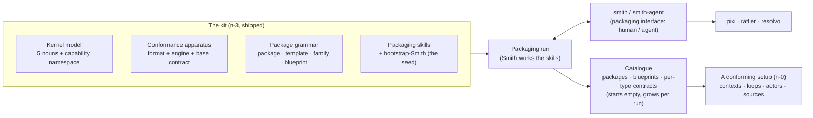
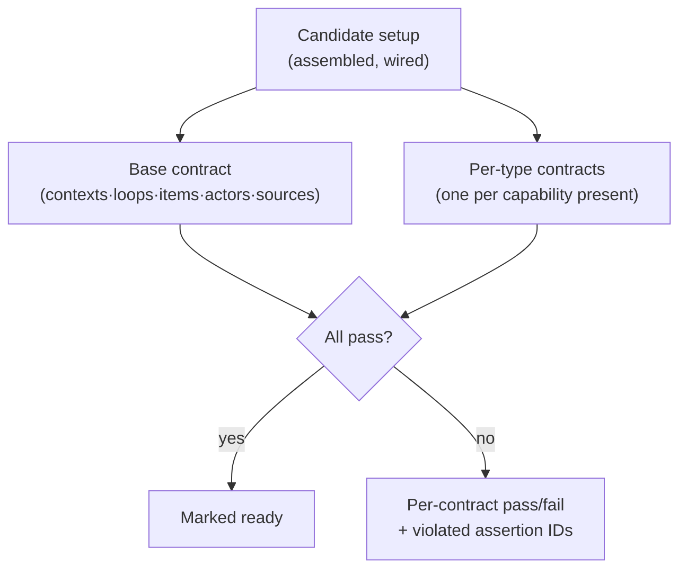
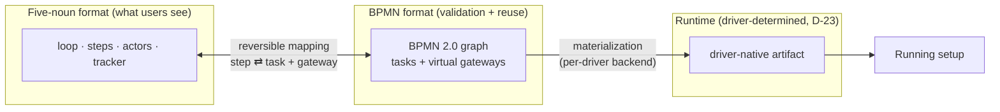

# Design — Loopsmith Kit (MVP, #178)

## 1. Overview

Loopsmith is a **kit** — a product in the sense a compiler toolchain or an IDE is a product: you run it to
build other things. What it builds are conforming **agentic setups** — running configurations of contexts,
loops, actors, and sources. Its users span four personas — **P1–P3** (Loopsmith developer, family author,
package author) build and grow the catalogue; the **P4 end user** stands up, wires, runs, and evolves
setups — the primary target and the bulk of the feature set.

The kit names four **tiers** (we refer to them as n-3 … n-0): the **kit** itself (n-3) → a **family** (n-2, a
curated substrate for a domain) → a **blueprint** (n-1, a curated starting point for a use case) → the
**running setup** (n-0) the end user lives in. The kit's *package* model is borrowed directly from **RPM/dnf**
— packages with provides/requires, dependency resolution, metapackages (§3.3).

The kit is **concrete, runnable machinery** — **Smith** (the consultant agent), two command-line binaries
over the packaging engine — **`smith`** for humans and **`smith-agent`** for agents — and four bodies of
built-in content:

1. **The kernel model** — five nouns (`context · loop · item · actor · port`) and an open **capability
   namespace** every setup is expressed in.
2. **The conformance apparatus** — the contract **format** (a normative layer + a runnable test-plan, joined
   by assertion IDs), the **verification engine** that gates a setup as ready, and the single **base contract**
   every setup satisfies. Per-type contracts (one per capability type) are authored incrementally as the
   catalogue grows ([D-19](#8-design-decisions-living)) — catalogue content, not designed here.
3. **The package grammar** — the shapes of packages, agent/loop templates, families, and blueprints, and the
   provides/requires resolution semantics that compose them.
4. **The packaging skills** — discover → recommend → co-design → author → realize → verify → learn — carried
   by **Smith**, the single bootstrap agent.

The catalogue — families, blueprints, packages, templates — is **produced by running the kit**
([D-02](#8-design-decisions-living)); it starts **empty** and grows per run. Smith, the skills, and the
conformance apparatus are the concrete machine that produces it. Smith is the **single irreducible seed**,
operating in three persona-driven modes: in **training mode** (P1), Smith ships credentialed on structure
(BST-01) and apprentices on craft through supervised runs with the developer (BST-03), ending when it is
re-packaged as a conforming agent template (BST-04); in **building mode** (P2/P3), Smith authors families,
blueprints, and packages that grow the catalogue; in **user mode** (P4), Smith onboards end users (furnish)
and maintains their setups day-to-day — the developer blueprint ships Smith OOTB, so the same Smith that P1
trained is the Smith that serves P4 at n-0.

**Personas** (from [features.md](../requirements/features.md#personas)) span the lifecycle: **P1 Loopsmith
Developer** builds the kit and trains Smith; **P2 Family Author** grows new families/blueprints; **P3 Package
Author** authors the units the catalogue is made of; **P4 End User** stands up, wires, runs, and evolves a
setup — the primary target and the bulk of the feature set.

**MVP thesis and proof.** The headline claim is that swapping a capability provider — the canonical case is
`tracker: github → jira`, or `factory → base` substrate — is *just a package change*, with no kernel, family,
or new-type edit. The MVP proves this with **two real runs**: run #1 (Smith packaging the operator's
BotMinter into a `developer` blueprint on a `factory` family) and run #2 (`simple-assistant`, which **reuses**
run #1 and authors only the localized delta — a files-checklist tracker and a no-daemon substrate). The
abstraction is real **iff** the difference between two genuinely different setups collapses to a few packages.

**Kit, not product — and building is not shipping.** Like an IDE ships the tooling to build software but
never the software itself, the *kit* ships **no runtime**. The console, Loop Studio, daemon, and cross-context
digest a person pictures are **not part of the kit's deliverable**; their design lives in
[R-06](research/R-06-first-product-developer-blueprint.md)/[R-07](research/R-07-first-product-requirements.md).
The distinction that governs scope is **building a family versus shipping one**: #178 does not *ship* a
product, but it **builds and tests two** — a `developer` blueprint Smith onboards through a **web console**
(the operator's two-context setup: Smith hosted in a *personal* context and a *member of* the *professional*
one, producing a cross-context digest), and a `simple-assistant` blueprint Smith onboards through a **CLI**.
Both exist to validate the kit's central feature, **Smith**, against two genuinely different onboarding
surfaces. The runtimes those runs produce are the acceptance demo's *target* (AC-28/29), not the kit's
deliverable.

**The four falsifiable claims** (validation hypotheses — distinct from the §8 D-NN decisions). The kernel
contract's distinctive claims, which the two deliberately-different conforming setups are built to
*falsify* (idea-honing Q-02; all four are required):

| Claim | What two conforming setups prove |
|---|---|
| **D-i — Tracker-agnostic loop** | the same loop runs over a `github` and a `files-checklist` tracker, plus an in-place `github→jira` swap — the loop/tracker split is real |
| **D-ii — Context + port** | connecting a second context changes what a loop can do — **autonomy comes from context, not config** |
| **D-iii — Actor uniformity / touchpoint** | a step's performer is human or agent via the same kernel op; a human step is a touchpoint (a context gap) |
| **D-iv — Membership ≠ access** | a datum's context is fixed by **declared membership**, not by access or transport |

*Naming note:* D-i…D-iv are the falsifiable validation hypotheses; the numbered **D-01…D-23** in §8 are the
design decisions — two different sequences.

---

## 2. Requirements Summary

The authoritative requirement text lives in [features.md](../requirements/features.md); this section
references it by series and does not duplicate it. 70 features across 12 series, in lifecycle order:

| Series | Journey | What it governs |
|--------|---------|-----------------|
| [BST-01…04](../requirements/features.md#bootstrap--the-apprenticeship-4-features) | Bootstrap | Smith ships credentialed on structure; runs against real systems with an empty catalogue; grows craft via supervised practice; is re-packaged as a conforming agent template. |
| [PKG-10…04](../requirements/features.md#family-authoring--growing-the-kits-reach-4-features) | Family authoring | Build new families & blueprints with Smith; publish packages (incl. private catalogues); feed structural friction back to the kit. |
| [PKG-01…09](../requirements/features.md#packages-9-features) | Packages | Declare provides/requires (+ version constraints); unique capability identity; per-type conformance contract; actor⟂loop-template composability; declared coding-agent support; lifecycle hooks; a meta-skill and its application. |
| [PKG-14…05](../requirements/features.md#discover--choose-5-features) | Discover & choose | Browse blueprints/packages; capability specificity; surface alternatives and unresolved capabilities. |
| [PKG-19…05](../requirements/features.md#the-consultation--conversational-discovery-with-smith-5-features) | The consultation | Conversational, adaptive discovery; explained recommendations; redirectable proposals; meaningful architecture choices; an approved shared understanding before building. |
| [PKG-24…09](../requirements/features.md#build-a-setup-with-the-builder-agent-9-features) | Build with the builder | Accept a target & elicit needs; recommend reuse-first + name gaps; author packages, new capability types, and reusable templates; surface friction; gate remediation; report contract violations; discover & absorb new catalogue capabilities without re-shipping. |
| [PKG-33…09](../requirements/features.md#assemble-wire--verify-9-features) | Assemble, wire & verify | Resolve a sufficient package set; install a blueprint as a unit; install packages into a workspace; assemble; configure/connect sources; base + per-type contract verification gating readiness; installed-inventory; multi-agent placement constraint. |
| [CNTXT-01…05](../requirements/features.md#contexts-sources--connection-rules-5-features) | Contexts & sources | Connect contexts via sources with configurable access; membership ⟂ access; declared context membership & unification; exactly one home source per context; multi-source contexts. |
| [CONF-01…11](../requirements/features.md#what-a-conforming-setup-contains-11-features) | The house spec | ≥1 agent, ≥1 loop; tracker-agnostic loops; per-loop workflow; per-agent config; HITL gates; routed operator comms; human↔agent actor parity; multi-context actors; binding equip-check; agent-template declares harness, bound at instantiation. |
| [PKG-42…05](../requirements/features.md#operate--evolve-a-running-setup-5-features) | Operate & evolve | Evolve a running setup with re-verification; remove packages; version + upgrade/rollback; incremental builder operation; runtime skill-package install. |
| [LEARN-01…03](../requirements/features.md#smith-gets-better-at-serving-you-3-features) | Per-user growth | Persistent friction/outcome memory; grounded advice citing prior runs; catalogue grows from end-user runs. |
| [OBS-01](../requirements/features.md#cross-cutting) | Cross-cutting | Adjustable-verbosity observability of Smith and packaging operations from day one. |

**MVP trims cardinality, never concepts.** Every kernel noun and every capability concept is present and
load-bearing (Q-02/Q-04); the only dial is **cardinality** — "the few, not tens." What is minimal is the
**catalogue**, and it is minimal only because it is *produced* by exactly the two runs the MVP exercises. The
packaging skills ship complete — they *are* the kit. There is no "simple now, refactor later": this is the
moment the abstraction is set.

**MVP cut.** The spine is must-have: Smith trained (BST), the package grammar + per-type contracts
(PKG/AWV), dual-blueprint conformance *via the skills*, and in-place evolution (OPS). Softenings are carried
in each feature's RFC 2119 keyword (PKG-06/07 MAY, PKG-30 SHOULD, CONF-06 MAY, CNTXT-05 MAY). Post-MVP and
excluded: `calendar`/`email` sources, fully-autonomous self-improving Smith, dual-UX within one blueprint.

---

## 3. Architecture

### 3.1 The kit is a generator

The kit's runtime is not a server that hosts setups; it is the **machinery that produces and verifies**
them. Concretely, the kit is the four shipped artifacts of §1 plus **two binaries over one packaging
engine** — `smith` for human operators and `smith-agent` for agents — together the sole interface to every
packaging operation (e.g. resolve, install, wire, verify, query; full surface in §4.9). Behind them sits the packaging infrastructure
(pixi/rattler/resolvo, [D-13](#8-design-decisions-living)); Smith, the consultant agent, drives `smith-agent`
and never invokes the infrastructure directly ([D-14](#8-design-decisions-living)). The kit ships the machinery that produces content, not
pre-built content ([D-02](#8-design-decisions-living)).

### 3.2 The kernel model (the five nouns)

Every setup is a graph of five irreducible nouns. They are the vocabulary all contracts and packages are
written against, and they are what Smith ships credentialed on ([BST-01](../requirements/features.md#bootstrap--the-apprenticeship-4-features)).

| Noun | What it is | Load-bearing rules |
|------|-----------|--------------------|
| **context** | A named **domain of information and operations**. A context need not live in a single source: each connected source contributes a **fragment** of a context, and all sources a user **declares** to belong to the same context are unified into one context ([D-08](#8-design-decisions-living)). | Exactly **one home source** per context; no two contexts share a home source (CNTXT-04). Sources declared to the same context are treated as one (CNTXT-03); a source's context membership is declared per source and is independent of its access (CNTXT-01). |
| **loop** | A **tracker-agnostic process** over work items: steps · events · gates (the `ralph.yml`-equivalent, raised to structured data — its second format is BPMN, §3.10). A loop's **steps** are its executable process; the **item statuses** work moves through are defined separately, by the loop's workflow (CONF-04). | Operates identically regardless of tracker (CONF-03). A setup has ≥1 loop (CONF-02). Steps and statuses are **decoupled**: a step **may** transition an item's status but need not, and an item **may** pass through several steps while holding one status — status changes follow the workflow, not step boundaries. Reconcile, onboarding, and formation are themselves loops. |
| **item** | A unit of work, tracked by a tracker, carrying exactly one **current status** from its loop's workflow — its lifecycle position, independent of which step is acting on it. | Status ∈ the workflow's status set; transitions follow the allowed graph (CONF-04), driven by the workflow, not by step boundaries. |
| **actor** | A performer of a loop step. Three kinds: **human** (reached through the interface as a touchpoint), **agent** (an LLM coding agent, run via a **harness**), and **automated** (a deterministic executor — a command or built-in action run by the **loop driver** itself, with no LLM). | Human↔agent are reassignable with no loop change and addressed identically by the loop (CONF-08 — extended to *automated*, [D-06](#8-design-decisions-living)); a single actor may be in >1 context (CONF-09); an **agent** actor carries an **identity** and a **harness**, an **automated** actor a bound action, a **human** actor neither. |
| **port** | The governed **access edge** by which a loop step (or actor) reaches a source or system lying across a context boundary — the one doorway through which anything inside a setup touches anything outside its own context. It carries the dials that govern that access: **authority** (rw/ro/none) and **disclosure** ([D-08](#8-design-decisions-living)). It is a first-class noun the way a kernel module is core — dependent on a context, yet the named, contracted primitive all boundary access is built on. | Membership tunes a port's disclosure level; membership is **declared** and is **independent** of access (CNTXT-01). Connected systems are modeled as ports on steps. |

A **source** (the backing system of a context — a `source` *capability*, §3.3) is reached **through a port**;
a context's **home source** is its designated home port-connection. So `source` is a capability, `port` is the
access noun it manifests as — they are different taxonomies, not competing for the fifth noun.

Two consequences of membership being the context boundary (idea-honing Q-05): an actor may belong to **more
than one context**, and its cross-context reach comes from **membership, not elevation** — membership sets a
port's disclosure to member-grade, so the actor reaches everything it belongs to without a privileged
escalation path (this is what lets one Smith span a personal and a professional context). And the **tracker
board is a shared surface, not the context boundary**: one board can host items from several contexts, so
board-visibility ≠ membership — what context an item belongs to is fixed by declaration, not by which board
shows it.

### 3.3 The capability namespace and the package model

Above the kernel sits an **open capability namespace**. A **capability** is a swappable slot with a contract:
the well-known types are `tracker · source · runtime · harness · interface · identity · planning`, and the
set is open — templates, skills, and infra are capabilities too. Each capability has a **unique identity**
(PKG-03) and is declarable at **multiple specificities** (PKG-16): a package that provides `tracker` and
`github-projects-tracker` satisfies a requirement for *either*.

**Everything reusable is a package** ([D-01](#8-design-decisions-living); RPM/dnf lineage). A package
declares only `requires: [capabilities]` and `provides: [capabilities]` over the one namespace. The
`provides` indirection is what yields **alternatives + swap + gating-by-absence** — without it a loop would
hard-code a provider and the swap thesis dies. From RPM the model inherits: **implicit self-provide** (a
`github` package provides `github`); **virtual provides at specificity**; abstract (many providers) vs
concrete (one) is **emergent, not declared**.

- **Families and blueprints are metapackages** — curated package-sets: a family is the substrate set, a
  blueprint is `family + leaf capabilities + templates` for a use case.
- **Gating is by absence** ([D-09](#8-design-decisions-living)): a family forecloses a capability by simply
  not including a package that provides it (no daemon package → no `runtime` type → a k8s package can't
  resolve).
- **Resolution** is a dnf-style `requires`-closure: the user declares leaf intent; the resolver walks the
  closure and the family gates it.

**Source operations are per-package — authored, not designed here.** A `source` capability exposes
**type-specific operations** beyond bare read/write (CNTXT-05): e.g. a `github-repo` source provides
`fork` / `branch` / `PR` / `issues`. Forking records an `upstream → fork` edge, and chaining forks
(`upstream → personal fork → bot-org fork`) gives an agent a known path to contribute back to a repo it
**cannot write to directly** — opening a PR up the chain across identities, without a separate
credential round-trip. The concrete operation set and the fork-chain mechanics are a **per-source-package
authoring activity** — a story-level package-building task during a run (run #1 authors `github-repo`),
not specified in this design.

### 3.4 The conformance apparatus (the house spec)

This is the kit's core and the design's real work. "A correct setup" is defined by **contracts**, and
verification against them is what gates a setup as *ready* (PKG-39).

- **One base contract** (PKG-38): every setup, regardless of capabilities, must satisfy the structural floor
  — ≥1 context (each with exactly one home source), ≥1 loop with a workflow, items with a valid status, ≥1
  agent and every step assigned an actor, sources connected.
- **One contract per capability type** (PKG-04): each type publishes the contract a provider must satisfy. A
  contract has **three faces**:
  1. **Required configuration** — the config a provider must accept/expose.
  2. **Required data relationships** — the structural relationships that must hold.
  3. **Required observable behavior** — what the provider must *do*, verifiably.

**Contracts are content; the design pins the machinery** ([D-19](#8-design-decisions-living)). The kit
fixes the contract *format* — a normative RFC 2119 layer + a runnable **test-plan** layer joined by stable
**assertion IDs** ([`conformance/`](../conformance/README.md)) — and the verification engine (§4.4); the
per-type contracts themselves are authored **incrementally as stories** during MVP (some Smith-assisted at
bootstrap, BST-02), landing as **catalogue content**, through that machinery — not designed in this doc.
Two are authored now as worked references — [base-setup](../conformance/contracts/base-setup.md) and
[work-tracker](../conformance/contracts/work-tracker.md); §4.4 keeps only a non-normative sketch of which
types MVP recognizes.

Verification (PKG-39) checks a candidate setup against the base contract **plus every applicable per-type
contract** — where *applicable* means the contracts authored for the capability types present. The engine
**discovers and loads per-type contracts by capability type** at verify time (a type's contract ships in its
package), so the set of authored per-type contracts is **deliberately open** and grows by story (and
post-delivery): a setup using a type whose contract is not yet authored is verified against the base plus
whatever per-type contracts *do* exist — the design does **not** enumerate or freeze a coverage set. What
*must* be pinned now (else contract-authoring stories build against an unproven mechanism) is the
**discover→load→execute-by-type path** (§4.4) and the format — both fixed here. Verification reports pass/fail
per contract and refuses readiness until all pass; a package that fails its type contract is reported with the
**specific violated assertion IDs** (PKG-31), never silently shipped.

### 3.5 Package, template, family, blueprint shapes

The grammar (detailed shapes in [§5](#5-data-models)):

- **package** — the unit of delivery (an RPM). Declares `provides`/`requires` capabilities (+ optional
  version constraints, PKG-02), MAY declare supported coding agents (PKG-06), MAY carry **lifecycle hooks**
  run at install/verify/uninstall (PKG-07), MAY ship a **meta-skill** (PKG-08), and carries content.
- **agent template** — the *who*: persona + skills + subagents + **declared supported harness**. Instantiated
  → an **actor** ([D-06](#8-design-decisions-living)).
- **loop template** — the *process*: steps · events · gates, agnostic of who runs it. Instantiated → a
  **loop**.
- **binding** — instance-time: **bind** an actor into a context + **assign** it the steps it performs — its
  **lane** (BPMN), a subset of the loop, not the whole loop. A loop carries **one binding per actor**;
  multi-actor loops are multi-lane processes (the sentinel's merge-gate is one lane of the same loop). The
  **equip/train fit-check** runs over **the actor's own steps** (skills present; its coding agent supports
  each of those steps' packages; if a gap is closable, **train**, else surface a **touchpoint**) (CONF-10).
- **family / blueprint** — metapackages (§3.3).

Agent template ⟂ loop template is a hard separation: the same loop template runs under different actors, and
an actor runs different loop templates (PKG-05) — no template-per-combination.

### 3.6 Smith and the packaging skills

**Smith is kit machinery** ([D-03](#8-design-decisions-living)) — the consultant/architect agent that
*runs* the packaging skills, and the single irreducible bootstrap seed. Smith operates in three modes, each
tied to the persona that uses it:

**Training mode (P1 — Loopsmith Developer).** Smith ships **credentialed on the structural model** (kernel +
grammar + contracts, BST-01) and **apprenticing on craft** (agentic best practices), growing the craft by
authoring skill-packages with the developer through supervised practice (BST-03). P1 runs Smith against real
systems with an empty catalogue, producing the first content (BST-02). Training completes when Smith is
**re-packaged as a conforming agent template** (BST-04) — Smith becomes a package that a blueprint ships.

**Building mode (P2 Family Author, P3 Package Author).** P2 and P3 use Smith's **build** loop to author
families, blueprints, templates, and packages — growing the catalogue with reusable content.

**User mode (P4 — End User).** P4 uses Smith for two activities: **furnish** (onboarding — fit a built
blueprint to a user) and **maintain** (troubleshoot a running setup day-to-day). The developer blueprint
ships Smith OOTB, so the same Smith that P1 trained is the Smith that onboards and maintains P4's setup at
n-0.

**Maintain-mode shepherding (rough idea — to be sharpened in a story).** Maintain rests on the kernel's
**touchpoint** (a gap an agent cannot cross without a human). The archetype (idea-honing Q-13): Smith notices
a loop is **stuck** (e.g. PRs repeatedly failing), **root-causes** it, and when the cause is something it
**cannot self-fix** because it needs human authority (e.g. an invalid test credential), it **escalates to the
operator** with the finding and a recommended action. This is shepherding *via a touchpoint* — **not** a
general anomaly-detection engine. The detection signals, root-cause heuristics, and escalation surface are
**deferred to a story**; this captures the intent, not the mechanism.

**Build is re-entrant** across modes ([D-04](#8-design-decisions-living)): hit a missing piece in user
mode → drop into building mode → produce it properly → return. The packaging method across all modes is
**discover → recommend → co-design → author → realize → verify (→ learn)**
([D-05](#8-design-decisions-living)) — elicitation and opinionated best-fit recommendation, not
transcription.

### 3.7 The packaging boundary (`smith` / `smith-agent`) and infrastructure

Every packaging operation goes through a kit-owned boundary exposed as **two binaries over one engine**
([D-14](#8-design-decisions-living)): **`smith`**, the human-facing CLI (concise, colored,
interactive), and **`smith-agent`**, the agent-facing CLI. Smith — the consultant agent — and any other agent
drive `smith-agent`; they never invoke the infrastructure directly. `smith-agent` is built for agent
consumption: **verbose**, emitting **machine-readable output** with **no color**, and deliberately
**corrective** — every response carries instructions on how to use the tool, what behavior is expected next,
and how to navigate an error, and it actively **helps agents discover its own features**. The error-as-
instruction and self-description affordances are what let an agent operate it reliably without a human in the
loop.

Behind both binaries the kit adopts **pixi / rattler / resolvo** ([D-13](#8-design-decisions-living)):
a package is a conda package on a
channel, a capability is a virtual package (`__tracker`, `__harness`, …; resolvo accepts arbitrary virtual
names — the namespace is genuinely open), a blueprint is a pixi environment, a family is a pixi feature,
resolution is the resolvo SAT solver, the lock is `pixi.lock`, and lifecycle hooks are conda scripts. This is
**HOW, not WHAT**: `features.md` stays capability-level and pixi-invisible, and "does pixi expose a
programmatic entry point for operation X" is a per-operation `smith-agent` question, not a feature question.
The pattern mirrors BotMinter's own discipline (`smith-agent : pixi :: github-project : gh`).

### 3.8 Self-describing: the system context and the floor

The kit is self-describing ([D-07](#8-design-decisions-living)): its own operations — onboarding,
repair, formation — are expressible as loops within the five-noun model, requiring no separate mechanism
outside it.

The kit ships a **system/management context** — a control-plane **loop** (onboarding + repair steps) that
depends on nothing the user can break. The loop is the control plane; the driver that executes it (what
runtime, what interface) is determined at runtime by Smith based on what is available
([D-23](#8-design-decisions-living)). This is kit-level
infrastructure, like Anaconda in Fedora: the kit ships the onboarding loop, any conforming blueprint inherits
it, and Smith adapts to the blueprint's capabilities — the same user-mode Smith works across all families and
blueprints.

**Onboarding is user mode (P4):** once a family and blueprint exist (produced by building mode), P4 picks a
blueprint and Smith's furnish loop runs — the system loop's first item is "create the first context"; once
the first context exists, Smith pivots from the system loop onto the user's loop. The **floor rule**: the
only hard runtime dependency is *a running LLM*; an emergency mode can rebind the system persona onto a bare
loop + a core harness (full recovery likely post-MVP, but the architecture must not preclude it).

### 3.9 How the catalogue comes to exist

Authoring is **front-loaded and decreases** as the catalogue matures: the more the catalogue already
contains, the less each new run must author and the more it reuses. The two MVP runs are the first two points
on that decline ([D-02](#8-design-decisions-living)): run #1 (Smith packaging BotMinter) produces the
`developer` blueprint on a `factory` family — the richest run, heavy authoring against an empty catalogue;
run #2 (`simple-assistant`) **reuses** run #1 and authors only the **localized delta** (a `files-checklist`
tracker + a no-daemon substrate). A small delta between two genuinely different setups is what proves the
abstraction. End-user runs then feed the catalogue further (LEARN-03), with consent.

### 3.10 From model to runtime: two formats, one runtime, and the transpiler

A loop has **two formats**. Users and Smith only ever work with the first one — the **five-noun format**
(loops · steps · actors · trackers, the grammar from §3.2–§3.5). When Smith assembles a setup (during
building or user mode), loop templates need to become **runnable artifacts** a driver can execute. The
**transpiler** is the kit machinery that does this — it runs during assembly, behind `smith-agent`, as part
of the build or furnish process.

Underneath, a loop **is a business process**, and Loopsmith does not invent a process language for it: the
**second format is BPMN 2.0** ([D-16](#8-design-decisions-living)). The analogy is **Java and
bytecode**: the five-noun format is the high-level language users write in; BPMN is the lower-level form used
for validation and interchange. The two convert in both directions without loss. Users never see BPMN — the
kit builds on it for validation and **library reuse** (`bpmn-js` as the editor core, standard workflow-net
validators). A blueprint MAY ship a loop-design capability (e.g. a Loop Studio powered by `bpmn-js`); if it
does, P4 designs loops through the five-noun format, and the BPMN layer powers the experience underneath.

**Two formats and one runtime:**

- **The five-noun format** (the high-level language) — loops · steps · actors · trackers (the grammar of
  §3.2–§3.5). The only thing users and Smith work with.
- **BPMN 2.0** — the format used for validation, interchange, and library reuse. The two formats convert
  in both directions without loss (which format is stored is a design detail, not decided here).
- **Runtime** — a **loop driver** ([D-23](#8-design-decisions-living)). The kit materializes the BPMN model to
  the driver's native artifact, which the driver executes. The kit **does not execute BPMN**: BPMN is
  source/IR, the materializer is the bridge, the driver is the engine. The driver is determined at runtime by
  Smith. MVP ships two drivers: **ralph-orchestrator** (`ralph.yml` + `PROMPT.md` + `.claude/`) and a
  **simple** file-driver.

**A loop = one driver-config artifact — that artifact is the boundary.** The unit a driver consumes is the
loop's identity: for ralph-orchestrator one `ralph.yml` (one `event_loop` ⇒ one loop, many hats inside); for
the claude driver one **skill file** (a single agent may carry many skill-loops). **Two artifacts are two
loops**, unconditionally — the boundary is the **artifact**, not the driver process (ralph 1:1, claude 1:N).
[D-18](#8-design-decisions-living).

**The mapping between the five-noun format and BPMN is mechanical, reversible, and total.** Each loop
**step** maps to a BPMN **task**
followed by a **virtual exclusive gateway**. The user draws steps joined by arrows; the gateway is implicit —
its branches are exactly the step's **published events** (`publishes`), and wiring `step₁ → step₂` adds a
branch automatically. switch/case/default routing is an exclusive gateway + default flow; a race on incoming
events is an event-based gateway — all **stock BPMN 2.0**. Reversibility is what lets the editor sit on
`bpmn-js` with only a thin step ⇄ task+gateway layer on top. **An agent-actor step is what BotMinter calls a
*hat*** — an LLM session whose prompt is the step's prose. The prose is **pure content**; all wiring lives in
the BPMN graph; the **only coupling** is the outcome vocabulary the prose declares and the gateway branches
on.

**Materialization — loop model to driver artifact.** During assembly the kit materializes the loop model to a
**driver-native artifact** ([D-23](#8-design-decisions-living)). Each driver defines its own artifact format
and materialization rules — the kit provides a per-driver **backend**. The materialization is assembler-shaped:
deterministic field-mapping plus a bounded set of transformers, not a compiler.

**How a driver defines constructs across the two formats (Ralph example).** Each driver defines its own
constructs in the five-noun format and their BPMN equivalents. For example, in Ralph a "hat" is a step — a
BPMN **task**. But a hat whose prose changes a GitHub status is a **status-altering step** — which maps to a
task + **exclusive gateway** (the gateway branches on the status outcomes). This is the general pattern: a
driver names a higher-level construct in the five-noun format and specifies how it decomposes into stock BPMN
elements.

**Status→step dispatch** is a consequence of this mapping: each status-altering step declares the **item
status it triggers on** (`status-in`) and the **status it moves the item to** on each outcome (`status-out`).
The materialization emits a status→step map; at runtime the driver's **dispatcher** reads each item's current
status and fires the matching step. "What fires next" is thus a property of the **workflow graph** (CONF-04),
not hard-coded in any step — which is what makes the driver swappable: a poll-based scanner, a push/event
subscription, and a cron trigger are different drivers over the same map. A step that declares **no**
status-out never advances its item, so **status-out is load-bearing for progress** — *structurally* checked
by the base contract (PKG-38; behavioral fidelity is the residual below).
([D-17](#8-design-decisions-living).)

**Ralph driver backend (MVP primary).** For ralph-orchestrator, materialization is **deterministic
field-mapping** plus exactly **two prose transformers** (render graph-wiring → prose, then compose header +
wiring-prose + step-prose → the step's `instructions`); every other rule is a direct field copy. The artifact
is `ralph.yml` + `PROMPT.md` + `.claude/`. Ralph's dispatcher is its **board-scanner** — a poll-based status
reader. The **single-step ralph path is validated** end-to-end: one step materialized to a valid `ralph.yml`
whose hat key-set is identical to a real BotMinter hat (`pr_gate`). What this validates is the *assembler
shape*, not coverage across drivers. Multi-lane loops, non-trivial wiring, and the **second (claude/file)
driver** are proven by their own stories.

**Status alteration is a declared property, not a guarantee.** Whether a step transitions an item's status is
a property the **package author declares** — carried on a step (hat) and on a skill; a status-altering
outcome expands to a BPMN branch bearing the `status-out`, a non-altering one does not. A driver MAY also ship
built-in status-altering steps, but for the two MVP drivers (ralph-orch + claude) alteration rides on
**status-altering hats and skills**. As with `publishes` the *declaration* is structural and
verifiable, but whether the prose actually performs the transition is not — and it is **weaker than the event
case**: events flow through the ralph-orchestrator bus, which whitelists the declared set, whereas status is
mutated **tracker-side, off ralph-orch's path**, so neither a missing transition nor a move to an *undeclared*
status is caught at runtime. **Blast radius if unhandled:** an item can strand (a status-altering step runs
but never advances it) or the board can drift to a status outside the declared workflow — silently, until
someone looks. The MVP **accepts this as a residual**, but its closure is designed now as a
**Loopsmith-portable detection point**, *not* the BotMinter-specific zero-trust shepherd: the loop driver's
dispatcher re-reads an item's status after a status-altering step and asserts the landing status ∈ the
step's declared out-set — expressible as a driver-portable observable-behavior (`BASE-BEH`) assertion so it
holds across the ralph and claude/file drivers alike. The **detection** belongs in MVP; its implementation is
*deferred to a story*. Runtime **prevention** (a driver/harness hook intercepting the mutation) stays post-MVP.
([D-17](#8-design-decisions-living).)

**Abstract-tracker binding — the loop stays tracker-agnostic.** A loop's steps never name a tracker; they
reference the abstract **`tracker` capability** and its contract operations (read item, set status, comment,
…). The concrete provider (`github-projects-tracker`, `files-checklist-tracker`, …) is resolved as a package and
**bound at transpile** (D-10 specificity; CONF-03): the same loop graph emits provider-specific calls — `github-project`
operations for one setup, file edits for another — with **no change to the loop**. This is the swap thesis
made concrete at the runtime boundary: tracker-agnostic in the model, provider-bound in the emitted
artifacts.

---

## 4. Components and Interfaces

Components are described by **responsibility and contract**, not implementation. The per-capability-type
**sketch** (§4.4) maps which types MVP recognizes; the normative contracts and their authoring format live in
[`conformance/`](../conformance/README.md), authored at bootstrap ([D-19](#8-design-decisions-living)).

### 4.1 Kernel model service
**Responsibility:** define and hold the five nouns and their invariants (§3.2); answer "is this graph a
structurally valid setup?" (the base contract's structural half). **Interface:** read/define contexts, loops,
items, actors, ports; assert the kernel invariants (one home source per context; status ∈ workflow;
human↔agent actor parity). **Guarantees:** kernel invariants hold for any setup it admits.

### 4.2 Capability registry
**Responsibility:** hold the open capability namespace — unique capability identities (PKG-03) and their
specificity relationships (PKG-16), and the per-type contract for each type (PKG-04). **Interface:** register
a capability/type + contract; resolve a requirement to providers at the right specificity; enumerate
alternatives (PKG-17) and unresolved capabilities (PKG-18). **Guarantees:** a `requires` for a general
capability is satisfied by any provider of a more specific variant; absence is surfaced, never silently
dropped.

### 4.3 Package & resolution surface (via `smith` / `smith-agent`)
**Responsibility:** the operations Smith drives — `resolve` (compute a sufficient, minimal package set
covering every requirement, PKG-33), `install` (a package into a workspace, PKG-35; or a blueprint as a unit,
PKG-34), `assemble` (PKG-36), `inventory` (track installed packages and what they provide, PKG-40), `remove`
(PKG-43), `upgrade`/`rollback` (PKG-44). **Interface:** a stable per-operation surface independent of the
backing infra (§3.7). **Guarantees:** placement honors the multi-agent coding-agent constraint (PKG-41) —
installable as long as ≥1 present coding agent supports the package, failing with the gap named only when
none does.

**Resolution is mechanical; presentation is judgment** ([D-20](#8-design-decisions-living)). `resolve`
produces a *complete* result deterministically — the sufficient set, the **lock** (the reproducible receipt,
§5.5), and a per-choice **rationale**; on a multi-provider capability it records a default pick rather than
blocking. The coding-agent constraint (PKG-41) is modeled *inside* resolution as a `requires` over the
**disjunction of present `harness:<agent>` capabilities** — so a package resolves iff ≥1 present harness
supports it — not as a post-resolution filter; the per-step actor↔harness match stays the bind-time
**fit-check** (§4.5), not the resolver's job. **Smith** then presents that result with judgment (PKG-20/04)
— surfacing the decision-worthy choices, stating the rest as the plan and its consequences — and the user
reviews, redirects, and approves before assembly (PKG-21/05). The design fixes *that Smith judges what to
surface* (trained craft, BST-03), **not a surfacing policy**; the lock is the full receipt and any pick is
overridable.

**Choices vs. consequences.** The user makes the choices that are genuinely theirs — which capability, when
there are several real options (which tracker, which assistant). Everything that follows from a choice is shown
as the **plan**: before assembly the user sees the full set of packages that will be installed and approves it,
the way `apt` or `dnf` shows the transaction and asks y/n. Nothing is installed silently, but the user is not
asked to adjudicate every dependency. Which points are a real choice and which are just consequences is Smith's
judgment (BST-03), not a rule written into the design.

### 4.4 The conformance engine and the per-type contracts

**Responsibility:** verify a candidate setup against the base contract + every applicable per-type contract,
report pass/fail per contract with specific violations (PKG-39, PKG-31), and gate readiness.

**Base contract** (PKG-38): ≥1 context; each context has exactly one home source (CNTXT-04); ≥1 loop with a
workflow (CONF-02/04); items carry a valid status; every loop step has an assigned actor — human, agent, or automated (CONF-08); declared
sources are connected (live); and progress is **well-formed** — a **status-altering** step declares ≥1
outcome with a `status-out`, and every declared `status-out` is a valid workflow transition (the structural
half of the re-record guard; behavioral fidelity stays residual, §3.10).

**The contract machinery (what the design pins) vs. the contracts (content, authored at bootstrap).** A
contract is *content the kit produces*, not part of the kit's machinery ([D-19](#8-design-decisions-living)): the full catalogue of per-type contracts is authored when Smith is trained against real systems
(BST-02), the same way packages are. What the design pins is the **format and the engine** so any contract
authored later is verifiable the same way. The format ([conformance/README.md](../conformance/README.md))
is the knative split: a normative **contract** layer (RFC 2119 prose over the three faces) + a **test-plan**
layer (block-quote each clause → runnable check → machine-readable `[Output]` envelope), where every clause
carries a stable **assertion ID** (`«TR-BEH-04»`). The engine consumes that: it runs the base contract + each
applicable per-type contract, emits one `[Output]` record per assertion, and gates readiness on every `MUST`
passing — citing the **specific violated assertion IDs** on failure (PKG-31).

Two **reference contracts** are authored now to prove the format and seed the convention:
- [`conformance/contracts/base-setup.md`](../conformance/contracts/base-setup.md) — the base contract above.
- [`conformance/contracts/work-tracker.md`](../conformance/contracts/work-tracker.md) — the per-capability
  exemplar (the swap invariant, `«TR-BEH-06»`, and the general→specific match).

**Recognized capability types (a design sketch, not the normative contracts).** MVP recognizes the types
below so the namespace and resolver are grounded; the cells sketch the *intended shape* of each type's three
faces. These are **not** the normative contracts — those are authored at bootstrap through the machinery
above. `tracker` is fully worked in the reference; the rest land at bootstrap. The recognized-type set itself
is **open** — new types are recognized as their packages publish (D-21); the table is a grounding sketch of
what MVP expects to meet, not a closed taxonomy.

| Type | ① Required configuration | ② Required data relationships | ③ Required observable behavior |
|------|--------------------------|------------------------------|-------------------------------|
| **tracker** | A connection to a tracking backend; a **workflow definition** — statuses, transitions, gates (CONF-04). | Every item ↔ exactly one current status in the workflow (its lifecycle position, decoupled from loop steps); transitions ⊆ the declared graph; item ↔ assigned actor; item ↔ owning loop. | List/query items by status; create/read/update an item; transition status, **rejecting illegal transitions**; surface gates. Behavior is **identical across trackers** (CONF-03) — the swap thesis. |
| **source** | Connection values + a bound **identity**; a declared **context membership** and **access** (authority/disclosure); the home-source designation. | A source belongs to exactly one declared context; **membership ⟂ access** (CNTXT-01); a context's sources unify (CNTXT-03); exactly one home source per context (CNTXT-04). | `connect` → validate credentials → **confirm live** before treating as connected (PKG-37); expose **type-specific operations** (CNTXT-05); all cross-boundary access via a port (§3.2). |
| **identity** | A credential (per-actor or shared — a per-setup decision, CNTXT-02), bound to the connector/package that performs the work. | identity ↔ actor binding; **one identity MAY underpin multiple capabilities** (tracker + source sharing). | Authenticate as the bound principal for the capability's operations; mint/relay the credential where the substrate provides it. |
| **harness** | Which coding agent executes a step; the **agent template declares supported harness(es)**, concrete bound at instantiation (CONF-11, PKG-06). Applies to **agent-actor** steps only — automated steps run on the loop driver with no harness. | actor ↔ harness binding (agent actors); step ↔ package coding-agent-support is a **placement constraint** (PKG-41, CONF-10). | Drive a coding agent to execute a step; the only hard runtime dependency is **a running LLM** (§3.8). |
| **runtime** | Placement (local process · k8s pod · VM). | loop ↔ placement; the `runtime` type is present **only if** a substrate provides it (gating-by-absence). | Launch / restart / stop a loop in its placement; restart on failure (mechanism is driver-determined). |
| **interface** | Channel(s) (console · telegram · matrix …), bound to loops/actors. | Operator↔agent communication is **routed through the configured interface** (CONF-07); HITL gates surface here (CONF-06). | Deliver messages to/from the operator; pause a loop at a gate and resume on input; carry the consultation surface (§4.6). |
| **planning** *(coarse; contract deferred with calendar/email, §2)* | A planning engine bound to a file-context source + a tracker. | Writes spec artifacts to the home source; creates tracked items on the tracker. | Run an idea → design → breakdown pipeline that emits tracked work items. |

### 4.5 The binding / fit-check
**Responsibility:** at instance time, bind an actor into a context and assign it to a loop, running the
**equip/train fit-check** (CONF-10): for every step, is the actor equipped (skills present; its coding agent
supports the step's packages)? If a gap is closable by adding skills, **train**; else surface a **touchpoint**
(a human gate). **Guarantees:** an assignment does not take effect with an unequipped actor without surfacing
the gap.

### 4.6 Smith + the packaging skills (the consultation surface)
**Responsibility:** conduct discovery as an **adaptive conversation** (PKG-19), explain every recommendation
and its trade-offs (PKG-20), accept redirection/refinement and **re-evaluate downstream** (PKG-21),
present meaningful **architecture choices** (PKG-22), and produce an **approved shared understanding** before
building (PKG-23). Drives the build journey (PKG-24…09): accept a target & elicit needs, recommend
reuse-first + name gaps, author packages / new capability types / reusable templates, surface friction, gate
remediation on validation, report contract violations, and **discover & absorb** new catalogue capabilities
without being re-shipped (PKG-32). Accumulates per-user friction/outcome memory (LEARN-01/02).

### 4.7 The system context & onboarding loop
**Responsibility:** the firmware floor (§3.8) — the always-present system loop (onboarding + repair steps),
shipped as kit-level infrastructure that any conforming blueprint inherits. The loop is the control plane;
the driver is determined at runtime by Smith ([D-23](#8-design-decisions-living)). Onboarding is user mode
(P4): once a family and blueprint
exist, Smith's furnish loop creates the first context and pivots onto the user's loop. **Guarantees:**
depends on nothing the user can break; recoverable down to a running LLM.

### 4.8 Observability
**Responsibility:** from day one (OBS-01), expose adjustable verbosity/log levels and a stream of what Smith
and the packaging operations are doing — decisions, steps, failures — for every persona, to follow, debug,
and audit. **Interface:** verbosity control + an event/decision stream over the configured interface.

### 4.9 The packaging boundary — `smith` / `smith-agent`
**Responsibility:** the **sole** entry point to every packaging operation ([D-14](#8-design-decisions-living)),
exposed as two binaries over one operation surface — `smith` (human ergonomics) and `smith-agent` (structured
I/O for an agent) — mirroring BotMinter's `github-project : gh` discipline. **Operations (surface-level):**

| Verb | Purpose | Features |
|---|---|---|
| `search` | find providers of a capability | PKG-15 |
| `browse` | list blueprints + descriptions | PKG-14 |
| `query` | introspect the catalogue + structural model (types, contracts, inventory) | PKG-32, PKG-40 |
| `resolve` | compute the sufficient set + lock + rationale | PKG-33, PKG-41 |
| `install` | a package into a workspace, or a blueprint as a unit | PKG-34/03 |
| `wire` | configure + connect a source — validate creds, confirm live | PKG-37 |
| `verify` | run base + per-type contracts → per-contract pass/fail + violated assertion IDs | PKG-39, PKG-31 |
| `publish` | publish a package to a channel, consent-gated, public or private | PKG-12, LEARN-03 |
| `remove` · `upgrade` · `rollback` | lifecycle over an installed package | PKG-43/03 |
| `inventory` | what's installed and what each provides | PKG-40 |

**Guarantees:** packaging is reachable only here (no raw infra calls); every mutating op is reproducible
through the lock (§5.5). Authoring (a package, a new capability type, a template) is Smith composing content
and iterating via `verify` — not a separate verb.

### 4.10 Meta-skill application
**Responsibility:** apply a package's **meta-skill** (PKG-08) at the lifecycle moments its deterministic hooks
(PKG-07) cannot reason about (PKG-09). The hooks are the deterministic spine — scaffold, connect, clean up;
the meta-skill is the **judgment layer** the boundary loads into the acting agent at the matching point: the
`install` / `uninstall` / `runtime` section around the corresponding hook, and the `troubleshooting` section
when a hook fails or verification regresses. **Guarantees:** a package is configured, kept working, recovered,
and cleanly removed by an agent applying its own meta-skill — not by guesswork; sections are author-defined
and open (§5.1). ([D-22](#8-design-decisions-living).)

### 4.11 Catalogue, introspection & publish
**Responsibility:** make Smith's repertoire **runtime data, not baked knowledge** (PKG-32). Smith holds no
static capability list — it `query`-s the catalogue (channels of packages/blueprints) and the structural model
on each run, so a capability type or provider published since Smith shipped is usable immediately, and
**discovering a type yields its contract** (the contract ships in the type's package). The catalogue is
npm-like — package↔repo, channels public or private, no central registry — over the pixi/conda channel model
(§3.7). **Publish** writes a package to a channel, consent-gated; the channel's visibility decides public vs.
internal (PKG-12, LEARN-03). **Guarantees:** newly published capabilities are discoverable without re-shipping
Smith; nothing is published without explicit consent.

> **Deferred (post-MVP), [D-21](#8-design-decisions-living):** the cross-run **flywheel** — accumulating
> friction/outcomes across a user's runs and citing them in later advice (LEARN-01/02), and aggregating friction
> across authors (PKG-13). MVP keeps runtime introspection + consent-gated publish, **not** cross-run memory.

---

## 5. Data Models

Field names and types below are **external contracts** (manifest surfaces, contract shapes) and are
design-level; the two-format mapping is deferred to implementation. The concrete encoding maps onto
pixi/conda (§3.7) — that mapping is HOW and is not normative here.

### 5.1 Package manifest
A package declares the fields below. Some map directly to conda/pixi mechanisms (the packaging
infrastructure, §3.7/[D-13](#8-design-decisions-living)); others are kit-specific concepts that ride on
conda's extensibility (virtual packages, file content). The concrete encoding is HOW (behind `smith-agent`,
[D-14](#8-design-decisions-living)) and is not normative here.

- `provides`: capability identities (with specificity variants where applicable) — incl. **implicit
  self-provide**. *Maps to conda virtual packages (`__tracker`, `__harness`, etc.).*
- `requires`: capability identities, each with an **optional version constraint** (PKG-02). *Maps to conda
  dependency declarations + virtual-package requirements.*
- `version`: for upgrade/rollback (PKG-44). *Native conda package version.*
- `lifecycle-hooks`: optional behavior at `install` · `verify` · `uninstall` (PKG-07). *Maps to conda
  package scripts (post-install, pre-uninstall, etc.).*
- `content`: the files/skills/sources/etc. the package delivers. A delivered **skill** MAY carry the
  author-declared **`status-altering`** flag (§5.3) — surfaced identically to a step's, and equally unguarded
  at runtime. *The files inside the `.conda` archive — native.*
- `supported-coding-agents`: zero (agnostic) · one · several (PKG-06). *Kit-specific — encoded as a
  `requires` over `harness:<agent>` virtual packages, resolved in-solver (D-20).*
- `meta-skill`: optional; **sections** keyed by `install · uninstall · troubleshooting · runtime` **plus
  arbitrary author-defined sections** (PKG-08). *Kit-specific — prose sections for judgment-based lifecycle
  operations; rides as content inside the package.*

### 5.2 Capability & contract
- **capability**: a unique identity + its **specificity edges** (a variant `is-a` general type).
- **type contract**: the three faces (§4.4) expressed as **checkable assertions** over configuration, data
  relationships, and observable behavior. The **base contract** is the always-applicable structural assertion
  set.

### 5.3 Kernel nouns
- **context**: `{ name, home-source (exactly one), member-sources[] (each a declared fragment, unified into one context) }`.
- **loop**: `{ steps[], events (triggers/publishes), gates, workflow-ref, tracker-ref }` — tracker-agnostic;
  its second format is BPMN (each step ⇄ task + virtual gateway, §5.7).
- **step**: `{ name, actor-ref, trigger (status-in), outcomes[] }`, where each **outcome** =
  `{ name, publishes[], status-out? }`. **`status-altering`** is an author-declared property — true ⟺ some
  outcome carries a `status-out`; the same flag is declarable on a **skill** (§5.1). An agent-actor step is a
  BotMinter **hat**.
- **item**: `{ status ∈ workflow.statuses, assigned-actor, owning-loop }`.
- **actor**: `{ kind: human | agent | automated, identity? (agent), harness? (agent), action? (automated), contexts[] (≥1) }`.
- **port**: `{ authority: rw|ro|none, disclosure, membership-grade }` — the sole cross-boundary edge.

### 5.4 Templates, binding, metapackages
- **agent template**: `{ persona, skills[], subagents[], supported-harness[] }` → instantiates to an actor.
- **loop template**: `{ steps[], events, gates }` → instantiates to a loop.
- **binding**: `{ actor-ref, context-ref, loop-ref, steps[] (the actor's lane), fit-check-result }` — one per
  actor in the loop; the actor is fit-checked over its `steps[]`, not the whole loop.
- **family**: metapackage `{ substrate package-set }`. **blueprint**: metapackage `{ family-ref, leaf
  capabilities[], templates[], tracker/workflow config }`.

### 5.5 Setup & lock
- **setup**: the assembled, resolved, wired graph of kernel nouns + installed packages + connected sources +
  bound actors/loops, plus its **installed inventory** (PKG-40) and **verification status** per contract.
- **lock**: the resolved, reproducible package set (the `pixi.lock` equivalent).

### 5.6 Smith's per-user memory
- **friction/outcome record** (LEARN-01): per user/setup, an append-only record of what was decided and *why*,
  what didn't fit, and what was customized — feeding catalogue growth (LEARN-03).
- **friction disposition** — each friction item carries a state:
  `recorded → { remediation-proposed → validated → adopted | rejected } | deferred` (PKG-29/07), with optional
  cross-author aggregation (PKG-13). *MVP:* a friction item is recorded and dispositioned **within a run**;
  **cross-run** citation in later advice (LEARN-02) and cross-author aggregation are deferred
  ([D-21](#8-design-decisions-living)). Because the only consumer (LEARN-02) is post-MVP, the persisted record is
  **internal and unstable at MVP — not a compatibility surface**: its disposition vocabulary MAY change when
  the cross-run consumer lands, with no migration owed. The detailed vocabulary is *left to the story* that
  builds the consumer.

### 5.7 The two loop formats and the transpile

The transpiler runs during assembly (building or user mode), behind `smith-agent`, materializing loop
templates into driver-native artifacts. A blueprint MAY also expose loop design to P4 through the five-noun
format, with the BPMN layer and `bpmn-js` powering the experience underneath.

A loop has two formats (§3.10) — like Java source and bytecode. The five-noun format is the high-level
language; BPMN is the lower-level form used for validation, interchange, and library reuse. The two convert
in both directions without loss. Runtime artifacts are **generated** from the BPMN model, never authored
directly.

**Mapping between the two formats (five-noun ⇄ BPMN), per element:**

| Authoring element | BPMN element | Notes |
|---|---|---|
| **loop** | `process` | one process per loop |
| **step** | `task` + a **virtual exclusive gateway** | the gateway is implicit in the UI |
| **actor** (assigned to steps) | a **lane** | an actor owns its lane's steps; a loop is multi-lane ⟺ multi-actor |
| **outcome** (`{name, publishes[], status-out?}`) | a **gateway branch** (sequence flow) | branch set = the step's `publishes`; default flow = the unmatched case |
| **trigger** (status-in) | start/conditional event | the dispatch condition (§3.10) |
| **status-out** | a status-set on the branch | absent ⟺ non-`status-altering` |
| **event race** | event-based gateway | `MAY`, post-MVP |
| **call another loop** | call activity | reuse/composition |

The mapping is **total and reversible**, which is what lets the editor sit on `bpmn-js` (§3.10).

**Swimlane layout is a per-driver convention (MVP: hardcoded).** Lanes and sublanes carry **no execution
semantics** (BPMN assigns work through a step's performer, not its lane), so the *axis* used to group steps
into swimlanes is a presentation choice — fixed per driver for MVP: **ralph-orchestrator** → lane per **issue
type**, sublane per **hat prefix**; **simple** (file driver) → lane per **file**. The `actor → lane` row above
is the conceptual default; a driver MAY group on another axis. Configurable views are **post-MVP**
([D-18](#8-design-decisions-living)).

**Workflow → dispatch map.** The loop's **workflow** (`{ statuses[], transitions[], gates[] }`, CONF-04)
yields the **status→step map** the driver's dispatcher uses: `status-in → step`, and each
outcome's `status-out` is an allowed `transition`. A step with no `status-out` on any outcome cannot advance
its item (base-contract concern, §3.4).

**Transpile (model → runtime).** Emitting `ralph.yml` + `PROMPT.md` + `.claude/` is a **deterministic
field-map plus two prose transformers** — render graph-wiring → prose, then compose header + wiring-prose +
step-prose → the step's `instructions`; every other rule is a direct copy. This is validated on the
**single-step ralph path** (against a real BotMinter hat, `pr_gate`); multi-lane loops and the second
(claude/file) driver are proven per their own stories (§3.10), not claimed here. A **transformer** is
`deterministic | agent` (an LLM session + a transformation skill — Smith), mirroring the actor duality (§3.2).
The reverse direction (existing `ralph.yml` → model) is the same map read backward.

> **Deliberately left to stories (epic altitude):** the meta-skill section schema in detail, and the friction
> record's disposition vocabulary (§5.6, marked internal/unstable until the cross-run consumer lands). The
> design pins where these live and their contracts' shape; the field-level detail is story work.

---

## 6. Error Handling

The kit's error contract has one spine: **every failure is surfaced, never silently absorbed.** The same
discipline that makes a skipped `MUST` block readiness (§3.4) governs every other failure class — a setup
never advances on an unreported gap. Failures are reported on **two surfaces**, and the choice between them is
the audience split established in [D-14](#8-design-decisions-living) and [D-22](#8-design-decisions-living),
not a per-error decision:

- **The agent surface** — `smith-agent`'s corrective, machine-readable output. Every error is an `[Output]`
  envelope or a structured failure record: it names *what* failed (by capability identity or assertion ID),
  *why*, and the *next legal action(s)*. The error doubles as usage guidance (D-14) — an agent driving the
  boundary recovers from the message itself, without out-of-band docs.
- **The human surface** — Smith presents the same underlying failure with judgment (D-20): it states the
  consequence and the recommended remediation rather than dumping the raw envelope, loading the failing
  package's **`troubleshooting` meta-skill section** (PKG-08/09, [D-22](#8-design-decisions-living)) so the
  recovery advice is the package author's own knowledge, not guesswork.

A second axis classifies failures by what they do to the lifecycle:

- **Gating failures** halt forward progress — a setup MUST NOT be marked ready (PKG-39), a package MUST NOT be
  marked installed, a binding MUST NOT take effect. They correspond to `MUST`/`MUST NOT` obligations.
- **Advisory failures** are reported as warnings and recorded, but do not block — `SHOULD` violations,
  deferred friction, post-MVP-capability gaps.

### 6.1 Resolution failures — unresolved capability / no provider (PKG-18, PKG-25)

When `resolve` cannot satisfy a `requires` edge — no package in the reachable catalogue (any channel, PKG-12)
provides the capability at the requested specificity — it does **not** partially resolve and proceed. It emits
the **unresolved set**: each missing capability identity, the requirement chain that demanded it, and whether
the gap is *author-able* (a known type with no provider) or *unknown* (an unrecognized capability). The
builder presents this as the **gap list** (PKG-25) before any commitment, so the user sees the full picture —
what exists, what must be authored, what must be sourced — and never a half-built setup. **Gating.**

### 6.2 Contract-violation reporting (PKG-31, PKG-39)

When verification fails, the report is **per-assertion**, never a bare "failed." Each violation is the
`[Output]` envelope of §3.4 / [conformance/README.md](../conformance/README.md): the failed assertion ID, the
contract it belongs to, the provider under test, and the specific violation in `detail`/`evidence`. The three
verdicts compose per the readiness rule:

- a `fail` on any `MUST`/`MUST NOT`/`REQUIRED` assertion → the contract fails → **gating** (setup not ready,
  or — for PKG-31 — the authored package is reported non-conforming rather than shipped);
- a `skip` on a `MUST` → a **surfaced gap** that blocks readiness (never a silent pass — §3.4);
- a `SHOULD` violation → **advisory** warning.

The report is always the list of violated assertion IDs, so the user can decide whether to fix the provider or
amend the contract (PKG-31's own rationale).

### 6.3 Source connection / credential failures (PKG-37)

Connecting a source has three failure points, each reported distinctly so the user knows which stage broke:
**missing connection values** (prompt incomplete), **credential rejection** (values supplied, backend refused),
and **liveness failure** (authenticated, but the source is unreachable / not live). A source MUST NOT be
treated as connected until liveness confirms — so any of the three is **gating** on that source, and any base
or per-type assertion that depends on a live source (e.g. `BASE-BEH-01`) reports `skip`-as-gap rather than
passing against a dead backend. Credential values themselves are never echoed in error output (§10).

### 6.4 Binding fit-check gaps (CONF-10)

The bind-time equip/train check (§4.5) verifies an actor is equipped for **every step assigned to it** — the
skills the step uses, and that the actor's coding agent (harness) supports each such step's packages. A gap is
reported as a **typed fit-failure**: `missing-skill`, `unsupported-harness`, or `unsupported-package`, naming
the offending step and package. The binding MUST NOT take effect with an open gap (**gating**); the surfaced
options are the requirement's own three exits — equip the actor, switch its harness, or choose a different
actor. This is the runtime counterpart of the placement constraint resolved statically in
[D-20](#8-design-decisions-living): the solver guarantees a *present* harness capability, the fit-check
guarantees the *bound* actor matches it per step.

### 6.5 Friction capture & gated remediation (PKG-29, PKG-30)

When a target resists the model — part of it cannot be expressed in the kit's terms — the builder MUST surface
the resistance and **record it as friction** rather than forcing a fit (PKG-29). Friction enters the
disposition state machine of §5.6 / [D-22](#8-design-decisions-living):
`recorded → { remediation-proposed → validated → adopted | rejected } | deferred`. Remediation is **advisory
and consent-gated**: the builder SHOULD propose a fix, and when it does, MUST gate adoption on explicit user
validation (PKG-30) — friction never auto-mutates the kit. Unremediated friction is `deferred`, recorded
against the setup (LEARN-01), and does not block the rest of the build. *MVP scope:* disposition is within-run;
cross-run citation is deferred ([D-21](#8-design-decisions-living)).

### 6.6 Upgrade / rollback recovery (PKG-44)

Upgrade and rollback are **re-verified transitions**, not blind swaps. An upgrade that lands a setup in a
state failing any applicable contract is a **gating** failure: the setup is reported non-ready with the
violated assertion IDs (§6.2), and rollback to the prior locked package set (the `pixi.lock` equivalent, §5.5)
is the named recovery — returning the setup to its last verified-ready state. Because the lock is the receipt
of a previously-passing resolution, rollback is deterministic and always available; a failed *upgrade* never
destroys the ability to roll back.

### 6.7 Summary

| Failure class | Detected at | Surface | Gating? |
|---|---|---|---|
| Unresolved capability / no provider (PKG-18, PKG-25) | `resolve` | gap list (agent: unresolved set) | **gating** |
| Contract violation (PKG-31, PKG-39) | verify | violated assertion IDs (`[Output]`) | **gating** |
| Skipped `MUST` | verify | surfaced gap (§3.4) | **gating** |
| `SHOULD` violation | verify | warning | advisory |
| Source connect / credential / liveness (PKG-37) | connect | staged failure (which of the three) | **gating** (that source) |
| Binding fit gap (CONF-10) | bind | typed fit-failure + three exits | **gating** (that binding) |
| Friction / unremediated resistance (PKG-29/07) | build | friction record + gated remediation | advisory (deferred) |
| Upgrade lands non-conforming (PKG-44) | upgrade re-verify | violated assertions + rollback offer | **gating** |

---

## 7. Acceptance Criteria

Each `AC-NN` is a Given-When-Then scenario that operationalizes one or more features from
[features.md](../requirements/features.md). ACs are grouped by lifecycle journey; the two MVP runs (AC-28,
AC-29) are the end-to-end capstones. Every feature appears in at least one AC (§17 traceability). A feature
softened to `MAY`/`SHOULD` (§2 MVP cut) is verified at that obligation level. At epic altitude each AC fixes
the **observable to be checked**; the **exact fixture and signal** (which record, which two verbosity levels,
which assertion ID) are pinned **per story** — deliberately, not as a gap. Where an AC verifies agent judgment,
it names a **falsifiable proxy** rather than trying to test "good judgment."

**Bootstrap — the apprenticeship (BST)**

**AC-01:** Given a fresh kit with an **empty catalogue** and Smith shipped credentialed on the structural
contract, when Smith is run against a real target system, then it produces conforming packages without any
seeded catalogue content. *(BST-01, BST-02)*

**AC-02:** Given Smith has grown craft through a supervised authoring run, when the bootstrap completes, then
Smith is itself re-expressed as an **agent template** in the catalogue (self-describing) that **instantiates to an
actor satisfying the base contract's actor assertions** (BASE-REL-06/07/09) and **declares
persona/skills/supported-harness** (§5.4); full harness-conformance is checked by the `harness` contract once
authored (bootstrap). *(BST-03, BST-04)*

**Family authoring — growing reach (FAM)**

**AC-03:** Given a developer working with Smith, when they author a new family and a blueprint over it, then
both are produced as metapackages (family = substrate set; blueprint = family-ref + leaf capabilities +
templates + tracker/workflow config) that resolve and install as a unit. *(PKG-10, PKG-11)*

**AC-04:** Given an authored package, when the author publishes it to a private channel, then it is resolvable
only through that channel while public packages remain globally resolvable; and structural friction recorded
during authoring is fed back to the kit. *(PKG-12, PKG-13)*

**Packages (PKG)**

**AC-05:** Given two packages where one declares `requires: tracker` (optionally version-constrained) and
another declares `provides: github-projects-tracker` (a specificity variant of `tracker`), when `resolve`
runs, then the requirement is satisfied by the provider at either specificity, and a package with no provider
for one of its `requires` is reported unresolved (§6.1). *(PKG-01, PKG-02, PKG-03)*

**AC-06:** Given an agent template and a loop template authored as separate packages, when they are composed by
a binding, then each is independently reusable and the binding carries the fit-check result — neither requires
a combined "role" package. *(PKG-05)*

**AC-07:** Given a package declaring `supported-coding-agents`, lifecycle `hooks`, and a `meta-skill` with
keyed sections, when it is installed/verified/uninstalled, then the declared coding-agent support is honored
(MAY be agnostic), the hooks fire deterministically at their phases, and the **named meta-skill section appears
loaded in the operation's `[Output]`/log at its matching hook** (the falsifiable proxy for "applied"; exact
signal pinned per story, §4.10). *(PKG-06, PKG-07, PKG-08, PKG-09)*

**Discover & choose (DIS)**

**AC-08:** Given a populated catalogue, when a user browses, then blueprints and packages are listable, and a
capability requirement resolves across specificity levels (general or specific). *(PKG-14, PKG-15, PKG-16)*

**AC-09:** Given a capability with **several** real providers, when Smith reaches it, then the choice is
surfaced to the user; the full resulting package set is shown in the plan the user approves before assembly, so
nothing is installed silently; and given a capability with **no** provider, the unresolved capability is
surfaced (§6.1) rather than silently dropped. *(PKG-17, PKG-18)*

**The consultation (CNSLT)**

**AC-10:** Given a user describing a target conversationally, when Smith consults, then recommendations are
**explained** (carry a rationale), and a **redirect demonstrably changes the proposal** — the falsifiable proxy
for "adaptive": after the user drops/changes a need, the dependent capability and its consequents disappear
from the proposal (PKG-21 scale-back), where they would have remained absent the redirect. *(PKG-19,
PKG-20, PKG-21)*

**AC-11:** Given an in-progress consultation, when Smith reaches architecture decisions, then it presents a
**plan with its consequences** and **no assembly/build action occurs until an explicit approval is recorded**
(the falsifiable gate, PKG-23) — attempting to build before approval is refused. *(PKG-22, PKG-23)*

**Build with the builder (BLD)**

**AC-12:** Given an accepted target, when the builder runs, then it elicits the needs, recommends a setup
**reuse-first** (existing packages before new authoring), and **names the gaps** that have no existing
provider. *(PKG-24, PKG-25)*

**AC-13:** Given gaps in the recommendation, when the builder addresses them, then it can author packages, new
capability **types** (with their contracts), and reusable **templates**; and given a part of the target that
resists the model, it surfaces the resistance as **friction** and gates any remediation on user validation
(§6.5). *(PKG-26, PKG-27, PKG-28, PKG-29, PKG-30)*

**AC-14:** Given the builder authors a package that fails verification, when it reports, then it cites the
**specific failed contract assertions** (§6.2) and does not ship the non-conforming package; and given a
capability published after Smith started, the builder discovers and uses it without re-shipping (introspection,
D-21). *(PKG-31, PKG-32)*

**Assemble, wire & verify (AWV)**

**AC-15:** Given a set of `requires`, when `resolve` runs, then it returns a **complete sufficient package
set** with a lock; and a blueprint installs as a **single unit** while individual packages install into a
workspace. *(PKG-33, PKG-34, PKG-35)*

**AC-16:** Given installed packages, when the setup is assembled and its sources configured, then sources are
connected to concrete backings with credentials validated and liveness confirmed before being treated as
connected (§6.3). *(PKG-36, PKG-37)*

**AC-17:** Given an assembled candidate setup, when verification runs, then it is checked against the base
contract **plus every per-type contract authored for the types present** (the open set, §3.4 — the engine
discovers and loads them by capability type), reporting pass/fail per contract, and the setup is **not marked
ready until verification passes** (PKG-39); the installed **inventory** is recorded. *(PKG-38, PKG-39, PKG-40)*

**AC-18:** Given a step whose actor is a coding agent, when `resolve` runs, then coding-agent placement is
satisfied **in-solver** as a `requires` over present `harness:<agent>` capabilities (D-20), and an
unsatisfiable placement is reported as unresolved. *(PKG-41)*

**Contexts, sources & connection rules (CNTXT)**

**AC-19:** Given a context connected via a source, when access is configured, then access (authority +
disclosure) is set on the **port** and is **independent** of the source's declared context membership
(membership ⟂ access). *(CNTXT-01, CNTXT-02)*

**AC-20:** Given multiple sources declared to one context, when the context is materialized, then it is the
**union** of those source fragments with **exactly one home source**; a context with multiple member sources
is supported. *(CNTXT-03, CNTXT-04, CNTXT-05)*

**The house spec — a conforming setup (SET)**

**AC-21:** Given a candidate setup, when the base contract runs, then it requires **≥1 agent actor and ≥1
loop**, each loop **tracker-agnostic** with its own **workflow**, and each agent its own config — failing
readiness if any is absent (§3.4, `base-setup`). *(CONF-01, CONF-02, CONF-03, CONF-04, CONF-05)*

**AC-22:** Given a loop with HITL gates and operator communications, when verified, then gates are honored and
operator comms are routed; and a **human and an agent** actor are interchangeable at a step (actor parity).
*(CONF-06, CONF-07, CONF-08)*

**AC-23:** Given an actor assigned to steps across one or more contexts, when the binding is checked, then the
actor MAY participate in **multiple contexts**, the **equip-check** verifies it is equipped for every assigned
step (§6.4), and the agent template's declared **harness** is bound at instantiation. *(CONF-09, CONF-10,
CONF-11)*

**Operate & evolve (OPS)**

**AC-24:** Given a running setup, when a package is added or removed, then the setup is **re-verified** against
its contracts before the change is accepted (§6.6), and removal is clean. *(PKG-42, PKG-43, PKG-45)*

**AC-25:** Given a versioned package, when it is upgraded and the upgrade lands the setup non-conforming, then
the failure is reported with violated assertions and **rollback** to the prior locked set returns the setup to
its last verified-ready state (§6.6); a skill-package can be installed into a running setup. *(PKG-44,
PKG-46)*

**Per-user growth (USR)**

**AC-26:** Given a user's prior runs, when friction and outcomes accumulate, then they are recorded per
user/setup (LEARN-01), and end-user runs grow the catalogue under consent-gated publish (LEARN-03). *Cross-run
grounded advice (LEARN-02) is **deferred** post-MVP ([D-21](#8-design-decisions-living)) — verified as recorded,
not yet cited.* *(LEARN-01, LEARN-03; LEARN-02 deferred)*

**Cross-cutting (OBS)**

**AC-27:** Given the same Smith or packaging operation run at a **low** and then a **raised** verbosity, when
it completes, then the raised run emits **strictly more progress detail** (additional records, each citing the
operation by capability identity) and the level is honored — the falsifiable proxy for "adjustable
observability from day one"; the human-facing dial and the exact level set are pinned per story. *(OBS-01)*

**End-to-end MVP runs (capstones)**

**AC-28 — Developer authoring (the port run):** Given the bootstrapped kit with an empty catalogue, when a
developer consults with Smith to port a real loop (e.g. a BotMinter-style development loop) — discovering
needs, authoring the missing packages/types/contracts, assembling, connecting a tracker source, binding agent
actors, and verifying — then the resulting setup **passes base + every per-type contract authored for the
types it uses**, transpiles to a runnable `ralph.yml` + `PROMPT.md` + `.claude/` (§5.7), and enacts such that
**≥1 item transitions through its workflow** (the terminal observable, BASE-BEH-02 + a legal TR-BEH transition).
And the gate **refuses**: when a contract violation is injected (e.g. an unconnected source, or a tracker that
fails its illegal-transition assertion), readiness is **withheld with the specific violated assertion IDs**,
and granted only after the violation is fixed and re-verified. *(end-to-end across BST, CNSLT, BLD, PKG, AWV,
CNTXT, SET; proves the gate gates, not just that assembly succeeds)*

**AC-29 — Simple-assistant reuse (the reuse run):** Given the catalogue produced by AC-28, when a second user
stands up a **different** setup (a simpler assistant) by **reusing** existing packages and a blueprint — with
at most minor authoring — then resolution draws reuse-first and the setup verifies ready without
re-bootstrapping Smith. The **swap invariant is checked both ways** (`work-tracker` TR-BEH-06): two *conforming*
tracker providers yield the **same** observable loop behavior, **and a deliberately non-conforming provider
fails** the invariant — equality across two passing providers alone does not prove the guard catches a bad
swap. *(end-to-end reuse across DIS, AWV, SET, OPS; proves the generator abstraction, D-02)*

**Verification machinery & integrity (the proofs the abstraction rests on)**

**AC-30 — A newly authored contract actually gates (verification of the verification):** Given Smith authors a
**new capability type with its contract** through the conformance machinery (§3.4), when a setup provides that
capability but **violates a `MUST`** in the new contract, then the engine **discovers and loads the new
contract by type, runs its Part B, and refuses readiness citing the new assertion ID** — proving the
open-namespace promise ("grows with my needs *and stays verifiable*") rather than only that a contract can be
written. *(PKG-04, PKG-27, PKG-39)*

**AC-31 — Status-mutation detection (the D-17 guard):** Given a step declared `status-altering`, when it runs
but **fails to perform its declared transition**, or moves the item to a status **outside its declared
out-set**, then the driver-portable detection point (§3.10 — dispatcher status re-read, a `BASE-BEH`
assertion) **flags it** rather than letting the item strand or the board drift silently. *Implementation is
story-deferred; this AC is the named regression guard the residual is accepted against.* *(CONF-04, PKG-38;
closes the D-17 residual's detection half)*

---

## 8. Design Decisions (living)

> **The decision record.** Each `D-NN`: chosen option · alternatives · rationale · ADR (ADRs are generated,
> after the decision set is reviewed, for the starred entries ★). D-11 and D-12 were retired into D-13 during
> reconciliation; the IDs are kept as tombstones and never reused. Decisions deliberately deferred to stories
> are marked as such inline — a deferral here is a conscious epic-altitude scope cut, not an omission.

**D-01 ★ — Everything is a package over one open capability namespace.** *Chosen:* a single unit (package,
RPM/dnf lineage) declaring `provides`/`requires` over an open capability namespace; families/blueprints are
metapackages. *Alternatives:* the earlier driver / extension / capability-module taxonomy. *Rationale:*
the `provides` indirection is what yields alternatives + swap + gating-by-absence; the driver/extension line
collapsed under stress to mere provenance (R-03 R4), so one unit is simpler and stronger.

**D-02 ★ — The kit ships machinery, not pre-built content.** *Chosen:* ship contracts + grammar + skills +
bootstrap-Smith; the catalogue starts empty and is produced by running the kit; authoring front-loads and
decreases as the catalogue grows. *Alternatives:* ship a seed catalogue of pre-built families/blueprints. *Rationale:* avoids
one-offs, makes the two MVP runs the proof of the abstraction, and keeps the kit/instance boundary clean.

**D-03 — Smith is kit machinery, the single irreducible seed.** *Chosen:* one consultant agent runs the
packaging skills across three persona-driven modes: training (P1), building (P2/P3), and user (P4).
Ships credentialed on structure and apprenticing on craft, re-packaged as a conforming agent template.
*Alternatives:* a product-only persona + separate build tooling. *Rationale:* one seed serves all personas;
the same Smith that P1 trains is the Smith that serves P4 at n-0.

**D-04 — Smith operates in three persona-driven modes; build is re-entrant across modes.** *Chosen:* one
skill set, three modes tied to personas — **training** (P1: the apprenticeship, BST), **building** (P2/P3:
the build loop, authoring catalogue content), **user** (P4: furnish + maintain). Build is re-entrant from
user mode: hit a missing piece → drop into building → produce it properly → return. *Alternatives:*
onboarding as "a packaging run one level down." *Rationale:* unifies the experience under one agent + skills;
the persona axis (who uses Smith and for what) is clearer than a temporal axis (bootstrap vs steady state).

**D-05 — Packaging = discover → recommend → co-design → realize → verify (→ learn).** *Chosen:* elicitation +
opinionated reuse-first recommendation + co-design of gaps, not transcription. *Alternatives:* a transcription
/ intake-form builder. *Rationale:* the value is an architecture the user didn't know to ask for; reuse-first
keeps it grounded in the catalogue.

**D-06 ★ — Agent template ⟂ loop template, composed by a binding with an equip/train fit-check.** *Chosen:*
who (persona+skills+harness) and process (steps+events+gates) are separate packages, joined at instance time
by a binding that checks fit. *Alternatives:* a BotMinter-style monolithic "role." *Rationale:* independent
composability (PKG-05) avoids a template-per-combination; the fit-check makes human↔agent parity and
equip-gaps explicit.

**D-07 — Kernel = five nouns; the kit is self-describing.** *Chosen:*
`context·loop·item·actor·port`; the kit's operations (onboarding, repair, formation) are expressible as loops
within the model. *Alternatives:* a non-self-describing bootstrap path outside the model. *Rationale:*
reconcile, onboarding, and formation are all expressible as loops (verified under stress, R-03 R8);
self-describing keeps the floor inside the model with one hard dependency (a running LLM). (the
floor's driver is a runtime decision, [D-23](#8-design-decisions-living).)

**D-23 — The kit ships loops (control plane); the driver is a runtime decision.** *Chosen:* the kit ships
loop definitions (steps, events, gates) and the system loop (onboarding + repair). The driver that executes
them — what runtime, what interface — is determined at runtime by Smith based on what is available. Smith
bootstraps as a skill in any LLM/coding agent, evaluates the environment, and adapts. *Alternatives:* ship
a specific driver (e.g. daemon + event-bus) as part of the kit. *Rationale:* the loop IS the control plane;
the driver is an execution concern. Locking in a driver would constrain which blueprints the kit can serve.
Like Anaconda in Fedora: the installer ships with the kit and adapts to the family's capabilities (GUI or
text mode, daemon or daemonless).

**D-08 — Port is the sole access mechanism; context membership is declared per source and is independent of
access; a context is the union of the source fragments declared to it, with exactly one home source.**
*Chosen:* cross-boundary access only via ports (carrying authority + disclosure); a source's context
membership is declared by the user at connect time and trusted as authoritative; a context is identified by
name and materialized as the union of all sources declared to it. *Alternatives:* a computed-membership
resolver; modeling connected systems as nested subcontexts in the loop graph. *Rationale:* membership being
independent of access is a real user need (CNTXT-01); a computed membership predicate adds machinery with no
payoff, and a mis-declared source is ordinary user error.

**D-09 — Gating is by absence, not by `excludes`.** *Chosen:* a family forecloses a capability by not
including a provider; no conflict rules. *Alternatives:* declared mutual-exclusions. *Rationale:* no
exclusions are evidenced in the real system (R-03 R6); `requires` + absence is sufficient and simpler.

**D-10 — Capability specificity via virtual provides.** *Chosen:* a provider declares both general and
specific capabilities; a requirement at either specificity resolves. *Alternatives:* a separate
abstract/concrete taxonomy. *Rationale:* inherited from RPM multi-provide; lets users require `tracker` or
`github-projects-tracker` without knowing providers up front (PKG-16).

**D-13 ★ — Packaging infrastructure = pixi / rattler / resolvo.** *Chosen:* adopt the conda/pixi stack
(package=conda pkg, capability=virtual pkg, blueprint=environment, family=feature, resolver=resolvo,
lock=pixi.lock). *Alternatives:* rpm-rs, alpm, uv/PubGrub, Cargo, Nix, Homebrew (R-08). *Rationale:*
most complete stack with open virtual-capability resolution and embeddable Rust crates; no fork needed.

**D-14 ★ — Packaging is reached only through a kit-owned boundary, exposed as two binaries: `smith` (human)
and `smith-agent` (agent).** *Chosen:* one packaging engine behind two front-end CLIs — agents (including
Smith) drive `smith-agent`, humans drive `smith` — with pixi behind both. The agent-facing `smith-agent` is
verbose, machine-readable, color-free, and corrective: its responses and errors double as usage instructions,
next-step guidance, and feature self-discovery. *Alternatives:* a single binary serving both audiences; agents
invoking pixi/rattler directly. *Rationale:* decouples callers from pixi's surface (one auditable, swappable
seam); a human-ergonomic CLI and an agent-ergonomic CLI have genuinely different output contracts, so
splitting them lets each be optimal; the corrective, self-describing agent surface is what makes unattended
agent use reliable. Mirrors BotMinter's `github-project : gh` discipline.

**D-15 — BotMinter is a candidate-to-reuse under a product-first lens.** *Chosen:* reuse proven ops (ralph as
loop engine, daemon/event-bus, git/identity/workspace) underneath; reframe brain → a chief-of-staff loop +
interface (drop `digest` as a type); build interface, loop-as-structured-data, port/membership, and onboarding
fresh. *Alternatives:* port BotMinter as-is, or rebuild everything. *Rationale:* the lock-in risk is the
slot/capability, not the Nth provider; now is the only refactor window.

**D-16 ★ — A loop has two formats (five-noun + BPMN); the kit materializes to driver artifacts and does
not execute BPMN.** *Chosen:* adopt BPMN 2.0 as the second format for loops/processes.
The analogy is Java and bytecode: the **five-noun format** is the high-level language
users write in; **BPMN** is the lower-level form used for validation, interchange, and library reuse.
The mapping between them is mechanical, reversible, and total — a step maps to a BPMN
**task + virtual exclusive gateway** (branches = the step's `publishes`). Users work through the five-noun
format; a blueprint MAY expose the BPMN layer through a loop-design capability (e.g. Loop Studio powered
by `bpmn-js`). Which format is stored on disk is a design detail, not decided here. *Alternatives:* invent a bespoke loop-graph language; or execute BPMN on a BPMN engine.
*Rationale:* a loop *is* a business process and the BPM literature already solved its modelling/validation, so
reusing the standard buys an editor, validators, and interchange for free; executing BPMN would discard the
proven Ralph runtime and the agentic-hat model — so BPMN is source/IR and the driver is runtime, with
materialization validated as low-risk assembler machinery.

**D-17 — Status→event dispatch is owned by the loop driver's dispatcher, driven by the workflow's
status→step map.** *Chosen:* the workflow declares each step's trigger-status and status-out; materialization
emits the resulting map into the driver, and the driver's dispatcher dispatches by matching an item's current
status to the step that triggers on it. *Alternatives:* hard-code a firing order per step; a central
orchestrator outside the loop. *Rationale:* keeps "what fires next" a property of the workflow graph — making
the driver swappable (poll / push / cron over the same map) and making status-out load-bearing for progress,
checked by the base contract (PKG-38). *Residual:* whether a status-altering step (a declared, author-set
property on hats and skills) actually performs its transition is **not** runtime-guarded — weaker than
`publishes` (which the event bus whitelists), since status is mutated tracker-side, off ralph-orch's path, so
neither a missing nor an undeclared transition is caught. The MVP **accepts this as a residual**
with a concrete **blast radius** (item stranding; silent board drift to an undeclared status). *Closure — owned
now, implemented by story:* **detection** is in MVP as a **Loopsmith-portable** mechanism — the driver's
dispatcher re-reads status after a status-altering step and asserts landing ∈ declared out-set, expressed as
a driver-portable `BASE-BEH` assertion (AC-31) so it holds across ralph and claude/file — explicitly **not**
the BotMinter-specific zero-trust shepherd, which does not port. Runtime **prevention** (a harness/driver hook
intercepting the mutation) stays post-MVP.

**D-18 — A loop is one driver-config artifact; swimlane layout is a hardcoded per-driver convention for MVP.**
*Chosen:* the loop's identity and boundary is the artifact a driver consumes (ralph-orchestrator: one
`ralph.yml`; claude/skill driver: one skill file) — two artifacts are two loops; and each driver ships one
fixed swimlane convention (ralph → lane=issue-type, sublane=hat-prefix; simple/file → lane=file), since lanes
carry no execution semantics. *Alternatives:* a configurable view engine in MVP; a single neutral stored model
with pools/lanes as first-class stored structure. *Rationale:* BPMN has no default pool/lane semantics (it is a
modeling choice for a purpose), so baking one convention per driver ships now and stays reversible — the lane
axis is presentation, not execution. *Deferred to post-MVP:* configurable/dynamic views; the general
loop/context **boundary rules** (context→pool/port=message-flow, item+lifecycle, independent enactment,
reuse/ownership, cohesion); and the **hub-and-spoke** framing (BPMN as canonical interchange hub vs.
driver-native artifacts as persisted storage) with cross-driver portability/round-trip.

**D-19 — Normative contracts are content authored at bootstrap; the design pins the contract machinery and
ships two reference contracts.** *Chosen:* the design pins the contract **format** (a normative RFC 2119
layer + a runnable test-plan layer, joined by stable assertion IDs — [conformance/README.md](../conformance/README.md))
and the **verification engine** (§4.4), and authors **two** reference contracts
([base-setup](../conformance/contracts/base-setup.md), [work-tracker](../conformance/contracts/work-tracker.md));
the remaining per-type contracts are authored **incrementally as stories** during MVP (some Smith-assisted at
bootstrap, BST-02) and land as **catalogue content**, through that same machinery — shipped, just not designed
in this doc. *Alternatives:* specify all per-type contracts in the design now (the
prior §4.4 seven-row table). *Rationale:* contracts are *content* the kit produces, on the same lifecycle as
packages ([[package-is-delivery-unit]]) and on the structure/craft line BST-01/BST-03 already draw — Smith
ships credentialed on the format, apprentices on the contracts. Pre-specifying seven contracts is the wrong
altitude (implementation detail of content) and the wrong time (pre-bootstrap). The §4.4 table is demoted to a
non-normative sketch of which types MVP recognizes. *Scope (epic altitude):* the per-type contract set is
**deliberately open** — base + one worked sample (tracker) ship now, the rest are authored as stories and may
keep growing post-delivery; the design does **not** enumerate or freeze a coverage set. What it *does* pin,
because deferring it would make contract-authoring stories build against an unproven mechanism, is the engine's
**discover→load→execute-by-type** path (§3.4) and the contract format.

**D-20 — Coding-agent placement is a resolver constraint; resolution is mechanical and Smith presents with
judgment.** *Chosen:* model coding-agent support (PKG-41) as a `requires` over the disjunction of present
`harness:<agent>` capabilities, resolved inside resolvo — not a post-resolution filter; the per-step
actor↔harness match stays the bind-time fit-check (§4.5). `resolve` emits a complete sufficient set + lock +
rationale deterministically (default-pick on a multi-provider capability, never block), and **Smith** presents
it with judgment — surfacing decision-worthy choices, stating the rest as the plan + consequences — with the
user reviewing/approving (PKG-21/04/05). *Alternatives:* placement as a post-resolution check; a design-time
surfacing policy ("surface iff …"). *Rationale:* the solver already does disjunction satisfaction, so encoding
placement there avoids hand-rolled backtracking; and **what to surface is trained craft (BST-03), not a
build-time rule** — authoring a surfacing policy is the wrong altitude (the same content-not-machinery logic applied to behavior).
The lock is the receipt; any pick is overridable. *Edge:* because placement is satisfied against the
harnesses *present at resolve time*, removing or upgrading a package can re-open a previously-satisfied
placement; the resolver MUST report a placement-caused unresolve distinctly from a missing-provider one (§6.4).

**D-21 — Smith's repertoire is runtime catalogue data; the cross-run flywheel is post-MVP.** *Chosen:* Smith
holds no static capability list — it introspects the catalogue + structural model each run (PKG-32), so newly
published types/providers are usable without re-shipping, and a type's contract ships in its package;
publish is consent-gated, public/private = channel (PKG-12, LEARN-03). *Deferred:* cross-run friction/outcome
memory + citation (LEARN-01/02) and cross-author friction aggregation (PKG-13) — MVP keeps introspection +
publish, not cross-run learning. Since the only consumer is post-MVP, the MVP friction record is **internal and
unstable — not a compatibility surface** (§5.6); its disposition vocabulary may change when the consumer lands,
with no migration owed. *Rationale:* introspection keeps Smith current and is core; the flywheel is the
speculative part and thins cleanly like contracts did, de-risking MVP without closing the door.

**D-22 — Meta-skill is the judgment layer applied around deterministic lifecycle hooks.** *Chosen:* hooks
(PKG-07) are the deterministic spine; the boundary loads the matching meta-skill section (PKG-08) into the
acting agent at install/uninstall/runtime, and the `troubleshooting` section on hook failure or verification
regression (PKG-09). Friction carries a disposition state machine
(`recorded → {remediation-proposed → validated → adopted | rejected} | deferred`). *Rationale:* separates
mechanical setup from judgment cleanly — the agent recovers and configures by applying the package's own
knowledge, not guesswork.

> *Deliberately left to stories (epic altitude):* the detailed learning-mode method and Smith's
> derived knowledge manifest. The design pins where these live; the field-level detail is story work.

---

## 9. Testing Strategy

The conformance apparatus (§3.4, §4.4) **is** the bulk of the test strategy — the kit's job is to verify
setups, so its own verification machinery is exercised the same way it exercises user setups. Four layers:

- **Unit** — the deterministic seams: the resolver's capability→provider mapping (specificity resolution,
  unresolved-set emission), the transpile field-map and the two prose transformers (§5.7), the BPMN↔authoring
  reduction's totality and reversibility (§5.7). These are pure functions of their inputs and tested as such.
- **Contract** — every contract's **test-plan layer** (Part B) is a runnable suite: the base contract and each
  per-type contract. The two reference contracts ([base-setup](../conformance/contracts/base-setup.md),
  [work-tracker](../conformance/contracts/work-tracker.md)) ship with full Part B coverage and are the worked
  examples; `work-tracker`'s **swap invariant** (TR-BEH-06) is the regression guard for provider-agnosticism.
- **Integration** — the two MVP runs (AC-28 developer port, AC-29 reuse) exercised end-to-end against real
  backings, each including a **negative beat** (an injected violation that readiness must refuse, AC-28/29).
  The transpile is validated on the single-step ralph path (§5.7); the second driver is proven by its own story.
- **Behavioral** — Face ③ assertions exercised against live providers. The residual status-altering gap (D-17)
  is covered by a **driver-portable detection assertion** (AC-31 — dispatcher status re-read), the named
  regression guard the residual is accepted against, rather than the non-portable BotMinter shepherd.

Work follows the team TDD workflow (red/green/refactor per code-task). Authoring a new capability type means
authoring its contract's Part B alongside it — a type with no test-plan entry per `MUST` is incomplete by §3.4.
The per-story test obligations for lifecycle hooks / meta-skill application (PKG-07/08/09) and upgrade/rollback
recovery (PKG-44) are written with their stories; the design fixes that they are covered at the contract and
integration layers, not their field-level cases.

## 10. Security Considerations

- **The port is the authorization boundary.** All cross-boundary access is mediated by a port carrying
  `authority` (rw/ro/none) + `disclosure` + `membership-grade` (§5.3, D-08); there is no other access path.
  Membership ⟂ access (CNTXT-02) means declaring a source into a context grants no authority by itself —
  authority is set explicitly on the port. A mis-declared source is ordinary user error, not a privilege
  escalation, because the port still gates access.
- **Credential handling.** Source connection validates credentials and confirms liveness (PKG-37); credential
  values are **never echoed** in `smith-agent` output, error envelopes (§6.3), the lock, or friction records.
- **Author-supplied code runs.** Lifecycle hooks (PKG-07) and meta-skills (PKG-08) are package-author code/knowledge
  executed at install/verify/uninstall/runtime — a supply-chain surface. Publish is **consent-gated** and
  channel-scoped (PKG-12, LEARN-03); a private channel is the trust boundary for un-vetted packages. Provider
  trust is explicit via `supported-coding-agents` (PKG-06).
- **Known residual.** A `status-altering` step's actual tracker mutation is **not** runtime-guarded (D-17):
  status is mutated tracker-side, off ralph-orchestrator's event path, so neither a missing nor an undeclared
  transition is intercepted. The blast radius is item stranding or silent board drift. MVP closes the
  **detection** half with a driver-portable dispatcher status re-read (AC-31), not the non-portable
  BotMinter shepherd; runtime **prevention** (a driver/harness hook asserting the landing status is in the
  declared out-set) is a named post-MVP closure.

## 11. Observability

Observability is **not** a bolt-on: the `[Output]` envelope (§3.4) and `smith-agent`'s machine-readable,
corrective output (D-14) are structured observability by construction — every verification, resolution, and
error is already an inspectable record citing capability identities and assertion IDs. On top of that:

- **Adjustable verbosity from day one** (OBS-01, AC-27): every Smith/packaging operation reports progress at a
  caller-selected verbosity, low by default, raisable for diagnosis.
- **The verification report** (per-contract pass/fail + violated assertion IDs, §6.2) is the primary signal
  for "why isn't my setup ready."
- **Friction/outcome records** (§5.6, LEARN-01) are the observability of where the model resisted a target —
  the input to catalogue growth.
- **The installed inventory** (PKG-40) is the observable manifest of what a setup actually contains.

## 12. Performance

MVP is **not latency-bound** — the operations are interactive authoring/assembly, not a request hot path —
so the performance posture is "predictable and bounded," not "optimized":

- **Resolution** runs on resolvo (D-13), a mature SAT-class resolver; capability specificity is virtual-package
  resolution it already does efficiently. The complete sufficient-set + lock is computed once per resolve.
- **Verification** splits cheap from expensive (§3.4): the static half (faces ①/②, graph queries) always runs
  and is cheap; the behavioral half (face ③) is exercised against providers only as needed — the cost scales
  with the number of capability types present, not the catalogue size.
- **Transpile** is a deterministic field-map + two prose transformers (§5.7) — linear in loop size, no search.
- **Catalogue introspection** (D-21) is per-run; for MVP catalogue sizes this is a read, not a bottleneck.

## 13. Migration & Compatibility

- **Existing loops migrate via the reverse transpile.** An existing `ralph.yml` maps **back** into the model
  (§5.7, "the same map read backward"), so current BotMinter-style loops are an on-ramp, not a rewrite.
- **Contracts are forward-compatible by construction.** Assertion IDs are **append-never-renumber** (§3.4,
  conformance README): a published contract can gain assertions without breaking existing references or
  re-numbering downstream traceability.
- **Reproducibility.** The lock (pixi.lock equivalent, §5.5) pins a resolved set; rollback (PKG-44) returns a
  setup to a prior locked, verified-ready state (§6.6). Upgrades are re-verified transitions, never blind.
- **No backward-compat burden yet.** The kit is greenfield (no shipped catalogue to be compatible with, D-02);
  the compatibility surface that matters is *with the systems it reuses* (next section), not prior kit versions.

## 14. Impact on Existing System

The kit reuses BotMinter's proven operations under a product-first lens ([D-15](#8-design-decisions-living))
rather than rebuilding or porting wholesale. Blast radius:

- **Reused underneath (low churn):** ralph as the loop engine, the daemon/event-bus, git/identity/workspace
  plumbing. These are consumed, not reshaped.
- **Reframed (moderate churn):** BotMinter's `brain` becomes a **chief-of-staff loop + interface**, and the
  `digest` type is dropped — folded into the interface. This is the one existing-behavior change.
- **Built fresh (net-new, no impact on existing):** the interface, loop-as-structured-data (BPMN IR), the
  port/membership model, the conformance engine, and onboarding. These are additive.
- **The transpile target is a contract, not a fork:** the kit emits `ralph.yml` + `PROMPT.md` + `.claude/`
  that the *unmodified* Ralph runtime consumes (§5.7) — validated against the real `pr_gate` hat — so the kit
  depends on Ralph's existing artifact contract without changing it.

## 15. Documentation Impact

- **The agent surface is self-documenting** (D-14): `smith-agent`'s corrective output doubles as usage
  guidance and feature self-discovery, so agent-facing docs are largely *emitted*, not separately authored.
- **The consultation is the human UX** (CNSLT): Smith explains its recommendations and consequences in-band
  (AC-10/11), so the primary user-facing "documentation" is Smith's explanatory behavior, not a manual.
- **Authoring docs already exist as the conformance README** ([conformance/README.md](../conformance/README.md)):
  the contract format + test-plan convention is the doc a package/type author writes against; the two reference
  contracts are the worked examples.
- **Meta-skill sections are package-author docs** (PKG-08): `install`/`uninstall`/`troubleshooting`/`runtime`
  knowledge ships *inside* each package and is applied by the boundary (§4.10), so per-package operational docs
  travel with the package.
- **Net-new prose docs needed:** a short "what is Loopsmith / five nouns" orientation, and a changelog for the
  kit itself.

## 16. Appendices

### 16.1 Technology Choices

- **Packaging stack — pixi / rattler / resolvo** ([D-13](#8-design-decisions-living)). package = conda pkg,
  capability = virtual pkg, blueprint = environment, family = feature, resolver = resolvo, lock = pixi.lock.
  Chosen over rpm-rs, alpm, uv/PubGrub, Cargo, Nix, Homebrew: the most complete stack with open
  virtual-capability resolution and embeddable Rust crates, no fork needed.
- **Loop representation — BPMN 2.0 + `bpmn-js`** ([D-16](#8-design-decisions-living)). BPMN is the internal
  canonical IR (on-disk form, validation substrate, editor reuse); users work through the five-noun authoring
  face, and a blueprint MAY expose the BPMN layer via a loop-design UI. The kit transpiles to Ralph and does
  **not** execute BPMN. Chosen over a bespoke loop-graph
  language (would re-solve modelling/validation the BPM literature already solved) and over executing BPMN on a
  BPMN engine (would discard the proven Ralph runtime + agentic-hat model).
- **Boundary — two CLIs (`smith` / `smith-agent`) over one engine** ([D-14](#8-design-decisions-living)).
  Mirrors BotMinter's `github-project : gh` discipline; a human-ergonomic and an agent-ergonomic CLI have
  different output contracts, so splitting lets each be optimal behind one auditable, swappable seam over pixi.

### 16.2 Research Findings (summary)

The package model converged by collapsing the earlier driver/extension/capability-module taxonomy into **one
unit over an open capability namespace** ([D-01](#8-design-decisions-living)): under stress the driver/extension
line reduced to mere provenance, while `provides`/`requires` indirection alone yields alternatives, swap, and
gating-by-absence. No mutual-exclusions are evidenced in the real system, so gating is **by absence**, not
`excludes` ([D-09](#8-design-decisions-living)). Self-describing (reconcile/onboarding/formation all expressible
as loops) was verified under stress, grounding the five-noun kernel + system context
([D-07](#8-design-decisions-living)).

### 16.3 Alternative Approaches Considered

| Area | Chosen | Rejected alternative | Why |
|---|---|---|---|
| Unit model | one package over open namespace (D-01) | driver / extension / capability-module taxonomy | collapsed to provenance under stress |
| Catalogue | ship generators, empty catalogue (D-02) | ship a seed catalogue of families/blueprints | one-offs; weakens the abstraction proof |
| Loop IR | BPMN 2.0, transpile to Ralph (D-16) | bespoke loop language; execute BPMN on an engine | reuse standard tooling; keep proven runtime |
| Boundary | two CLIs over one engine (D-14) | single binary; agents invoke pixi directly | different output contracts; one auditable seam |
| Contracts | machinery + 2 reference, rest as content (D-19) | specify all per-type contracts now | wrong altitude + wrong time (pre-bootstrap) |
| Placement | in-solver `requires` over harnesses (D-20) | post-resolution filter; design-time surfacing policy | solver already does disjunction; surfacing is craft |
| Membership | declared, trusted, ⟂ access (D-08) | computed-membership resolver | machinery with no payoff; mis-declare = user error |

## 17. Traceability Matrix

Every feature in [features.md](../requirements/features.md) maps to at least one acceptance criterion. The
**Story** column is `—` until the story breakdown (plan.md) lands; **Verification Status** is `Pending` until
implementation verifies each AC. The two capstones (AC-28, AC-29) integrate the spine features end-to-end in
addition to the primary AC listed per row. The further link from an AC down to the **assertion IDs** that run
it exists today only for the authored contracts (base, tracker); for every other type that link is added as
the type's contract is authored (the open set, §3.4) — a deliberate consequence of contracts-as-content, not a
gap.

| Feature | Acceptance Criteria | Story | Verification Status |
|---|---|---|---|
| BST-01 | AC-01 | — | Pending |
| BST-02 | AC-01 | — | Pending |
| BST-03 | AC-02 | — | Pending |
| BST-04 | AC-02 | — | Pending |
| PKG-10 | AC-03 | — | Pending |
| PKG-11 | AC-03 | — | Pending |
| PKG-12 | AC-04 | — | Pending |
| PKG-13 | AC-04 | — | Pending |
| PKG-01 | AC-05 | — | Pending |
| PKG-02 | AC-05 | — | Pending |
| PKG-03 | AC-05 | — | Pending |
| PKG-04 | AC-30 | — | Pending |
| PKG-05 | AC-06 | — | Pending |
| PKG-06 | AC-07 | — | Pending |
| PKG-07 | AC-07 | — | Pending |
| PKG-08 | AC-07 | — | Pending |
| PKG-09 | AC-07 | — | Pending |
| PKG-14 | AC-08 | — | Pending |
| PKG-15 | AC-08 | — | Pending |
| PKG-16 | AC-08 | — | Pending |
| PKG-17 | AC-09 | — | Pending |
| PKG-18 | AC-09 | — | Pending |
| PKG-19 | AC-10 | — | Pending |
| PKG-20 | AC-10 | — | Pending |
| PKG-21 | AC-10 | — | Pending |
| PKG-22 | AC-11 | — | Pending |
| PKG-23 | AC-11 | — | Pending |
| PKG-24 | AC-12 | — | Pending |
| PKG-25 | AC-12 | — | Pending |
| PKG-26 | AC-13 | — | Pending |
| PKG-27 | AC-13 | — | Pending |
| PKG-28 | AC-13 | — | Pending |
| PKG-29 | AC-13 | — | Pending |
| PKG-30 | AC-13 | — | Pending |
| PKG-31 | AC-14 | — | Pending |
| PKG-32 | AC-14 | — | Pending |
| PKG-33 | AC-15 | — | Pending |
| PKG-34 | AC-15 | — | Pending |
| PKG-35 | AC-15 | — | Pending |
| PKG-36 | AC-16 | — | Pending |
| PKG-37 | AC-16 | — | Pending |
| PKG-38 | AC-17 | — | Pending |
| PKG-39 | AC-17 | — | Pending |
| PKG-40 | AC-17 | — | Pending |
| PKG-41 | AC-18 | — | Pending |
| CNTXT-01 | AC-19 | — | Pending |
| CNTXT-02 | AC-19 | — | Pending |
| CNTXT-03 | AC-20 | — | Pending |
| CNTXT-04 | AC-20 | — | Pending |
| CNTXT-05 | AC-20 | — | Pending |
| CONF-01 | AC-21 | — | Pending |
| CONF-02 | AC-21 | — | Pending |
| CONF-03 | AC-21 | — | Pending |
| CONF-04 | AC-21 | — | Pending |
| CONF-05 | AC-21 | — | Pending |
| CONF-06 | AC-22 | — | Pending |
| CONF-07 | AC-22 | — | Pending |
| CONF-08 | AC-22 | — | Pending |
| CONF-09 | AC-23 | — | Pending |
| CONF-10 | AC-23 | — | Pending |
| CONF-11 | AC-23 | — | Pending |
| PKG-42 | AC-24 | — | Pending |
| PKG-43 | AC-24 | — | Pending |
| PKG-44 | AC-25 | — | Pending |
| PKG-45 | AC-24 | — | Pending |
| PKG-46 | AC-25 | — | Pending |
| LEARN-01 | AC-26 | — | Pending |
| LEARN-02 | AC-26 (deferred) | — | Deferred (post-MVP) |
| LEARN-03 | AC-26 | — | Pending |
| OBS-01 | AC-27 | — | Pending |
